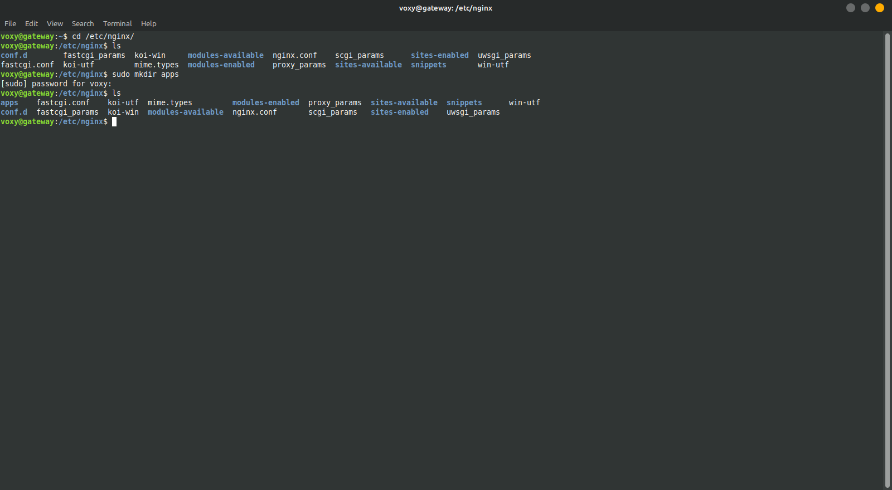
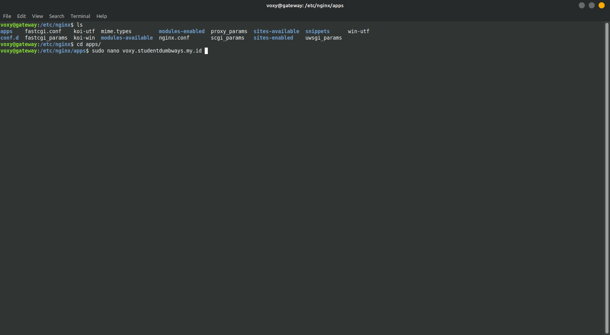
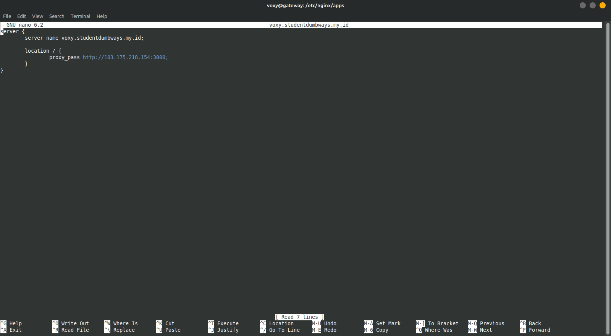
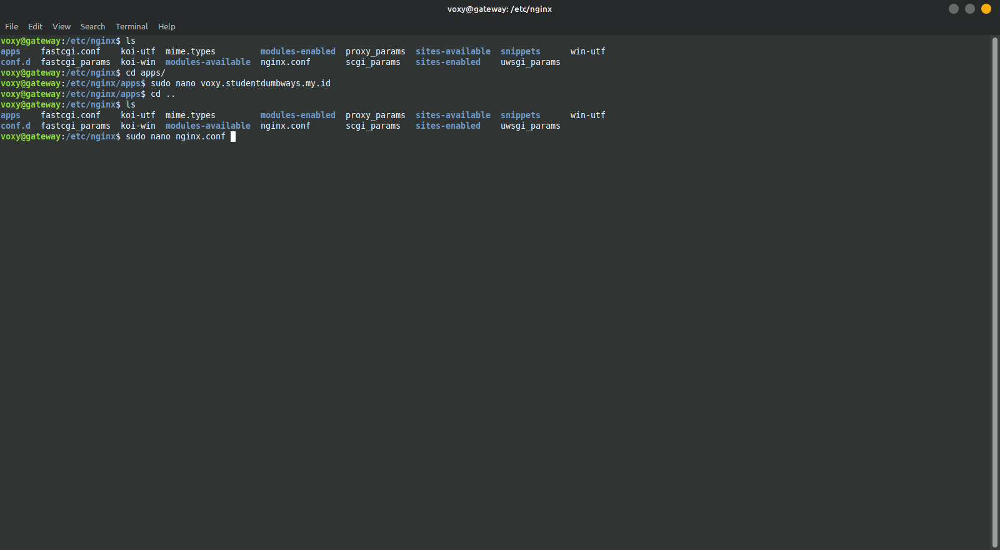
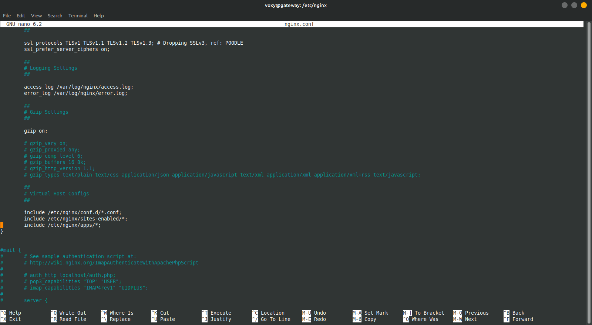
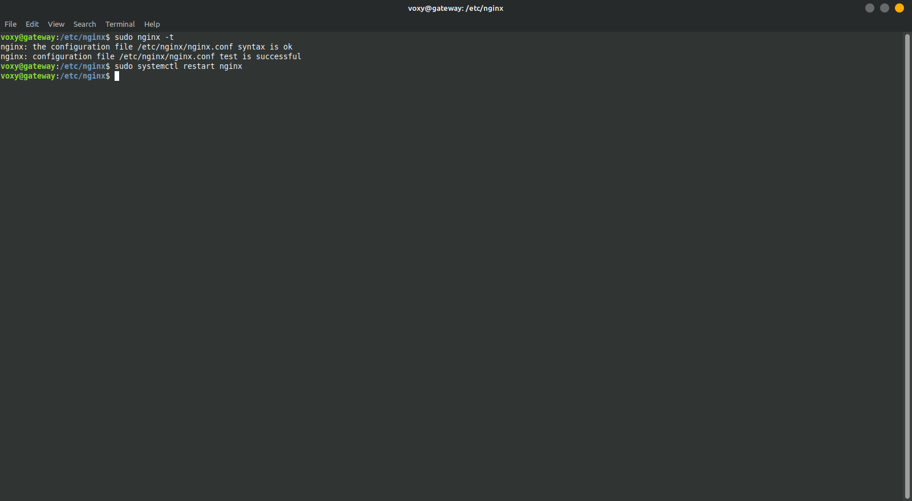

## Deploy Aplikasi, Konfigurasi Web Server & Reverse Proxy 
Berikut adalah dokumentasi langkah langkah bagaimana melakukan Deploy aplikas pada vm yang telah dibuat di BiznetGio mulai dari pembuatan user baru untuk menaruh berkas aplikasi hingga aplikasi dapat diakses secara publik.

1. Cloning aplikasi wayshub-frontend dengan git clone.
](deploy-application/clone-wayshub.png)
](deploy-application/git-clone.png)

2. Lakukan npm install untuk melakukan instalasi package atau dependensi yang dibutuhkan oleh aplikasi.
](deploy-application/npm-install.png)

3. Untuk melakukan pengecekan apakah aplikasi sudah aman, terlebih dahulu lakukan npm start untuk memulai aplikasi lalu melakukan cek dengan browser
 ](deploy-application/npm-start.png)
](deploy-application/npm-start-1.png)
Aplikasi dapat berjalan.

4. selanjutnya melakukan setting reverse proxy dengan membuat folder baru pada direktori /etc/nginx serta melakukan konfigurasi pada nginx.conf.
 
 

 
 
 

5. Melakukan setting dns cloudflare agar aplikasi dapat diakses menggunakan cloudflare
](deploy-application/cloudflare.png) 
](deploy-application/cloudflare-running.png)

6. Launch aplikasi menggunakan pm2 init simple.
](deploy-application/pm2-init-simple.png)  
 ](deploy-application/ecosystem.config.js.png)
 ](deploy-application/ecosystem.config.js-1.png)
](deploy-application/pm2-start-ecosystem.png)

7. Lakukan pengetesan pada browser.
](deploy-application/running-apps.png)