## Pembuatan VM Biznet & Install Kebutuhan Aplikasi
Berikut adalah dokumentasi langkah langkah bagaimana melakukan pembuatan VM di Biznetgio serta instalasi aplikasi-aplikasi yang dibutuhkan untuk melakukan deploy aplikasi wayshub-backend.

1. Langkah pertama jika sudah memiliki akun login pada website [BiznetGio](portal.biznetgio.com) atau lakukan pendaftaran akun baru. 
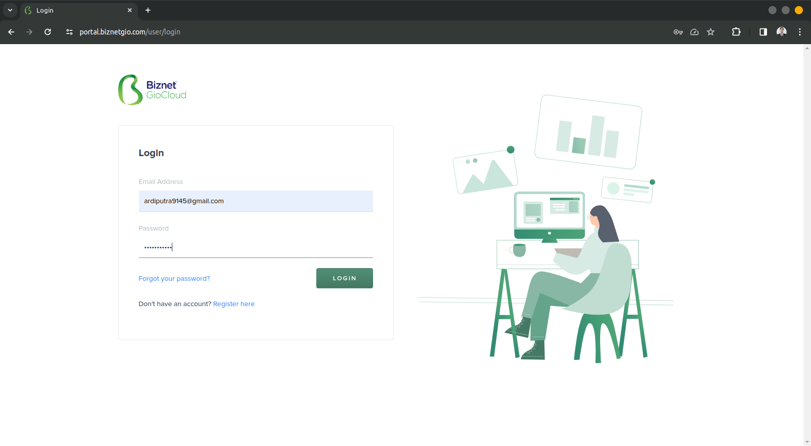

2. Jika sudah login, pada tampilan dashboard klik quick create lalu pilih NeoLite
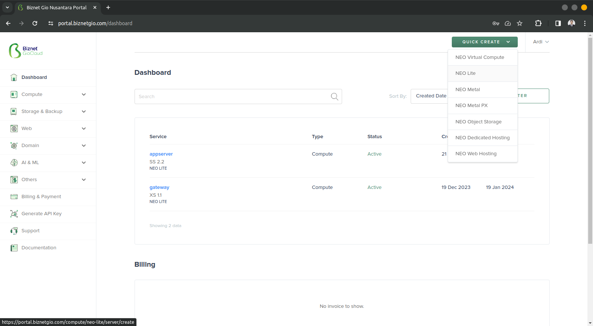

3. Saat sudah klik create, akan muncul tampilan untuk isi form, pada bagian ini isi form sesuai ketentuan atau keinginan.
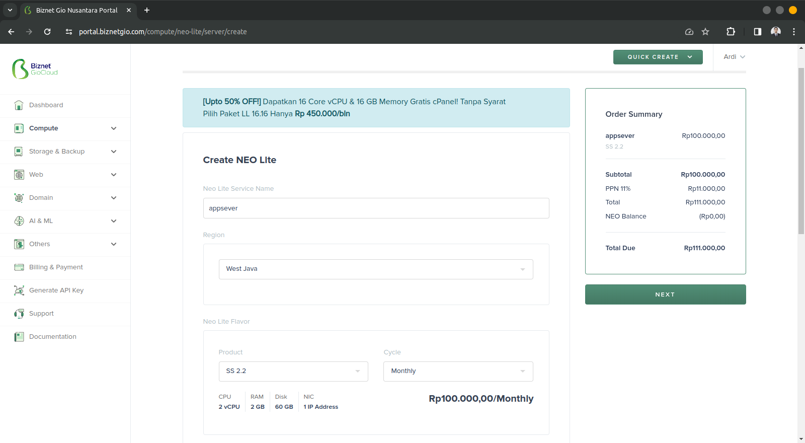
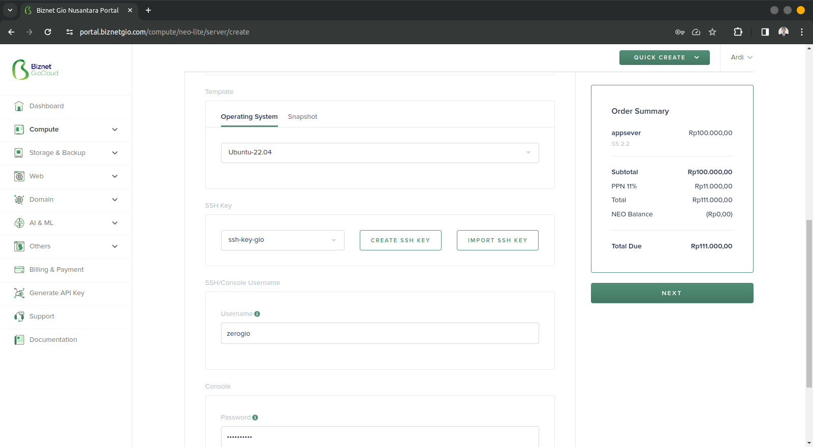
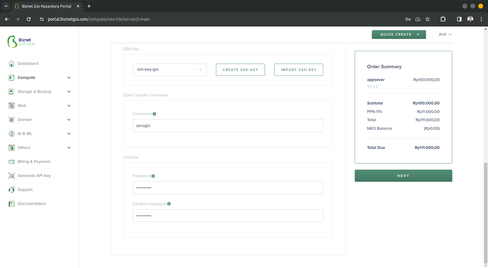
Adapun keterangan pada saat pengisian 
    - Service Name : Digunakan untuk mendefinisikan nama server, ex:Appserver, Gateway etc.
    - Region : Merupakan keterangan dari letak server
    - Product : Tipe dari produk yang ingin digunakan, berbeda tipe beda harga.
    - Cycle : Bagaimana pembayaran akan dilakukan, apakah bulanan atau tahunan.
    - Operating system : Sistem operasi yang akan digunakan oleh VM.
    - Snapshot : Digunakan untuk melakukan backup secara otomatis.
    - SSH Key : Digunakan untuk melakukan generate SSH Key yang berguna sebagai keamanan VM dalam melakukan remote akses.
    - Username : Username yang digunakan untuk melakukan remote console .
    - Password : Password yang digunakan untuk melakukan remote console.

4. Jika sudah, pilih pembayaran dan jika berhasil maka pada tampilan dashboard akan tampil server yang sudah dibuat.
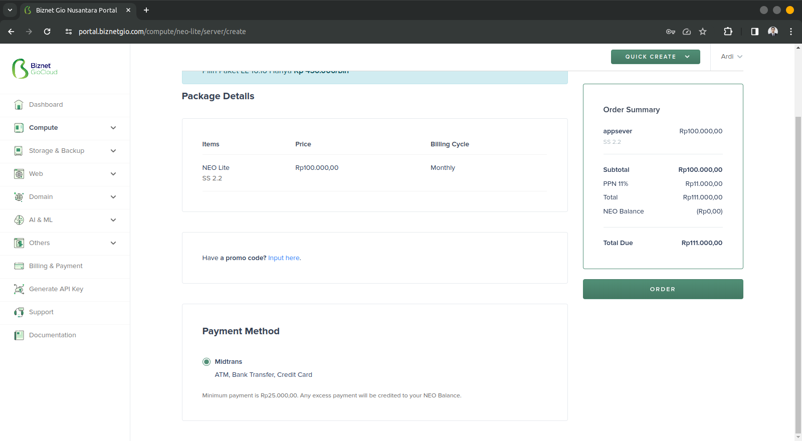
](setup-server&install-requirements/server-created.png)
Server kali ini menggunakan ssh key yang sama seperti pada saat setup server gateway pada dokumentasi sebelumnya [setup-server-gateway](../Day-1/setup-server&install-requirements.md)

5. Jika server sudah terbuat, coba lakukan remote console menggunakan terminal dengan ssh key yang sudah terdownload secara otomatis dan tersimpan pada folder download. Masuk ke dalam directory download kemudian remote server menggunakan ssh key dengan perintah :

    ```ssh -i ssh-key-gio.pem zerogio@103.175.218.154```

    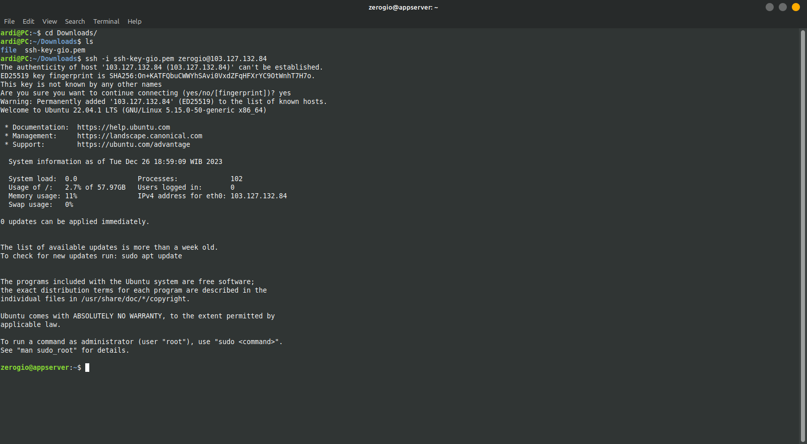
    
    >Penjelasan tentang ssh key terdapat pada link ini serta bagaimana menggunakan ssh key pada server. 

6. Lakukan update dan upgrade agar tidak terdapat error pada file system saat melakukan instalasi aplikasi ataupun saat melakukan konfigurasi.
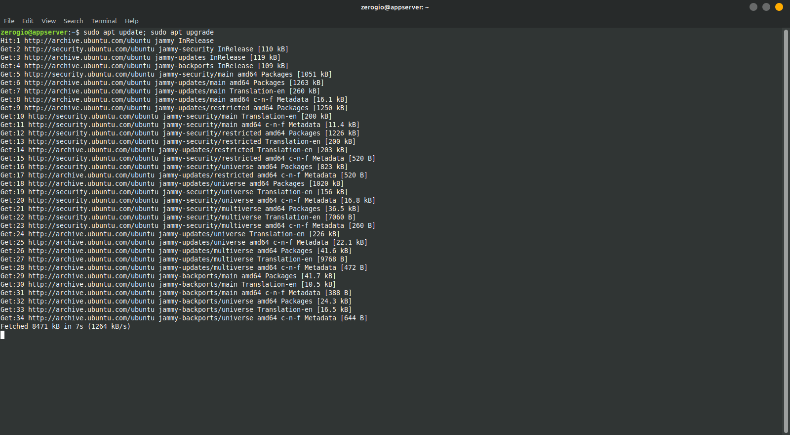

7. Membuat satu user baru serta memasukan ke dalam group sudo untuk digunakan dalam menjalankan aplikasi dengan perintah.

    sudo adduser ardi

    sudo usermod -aG sudo ardi

    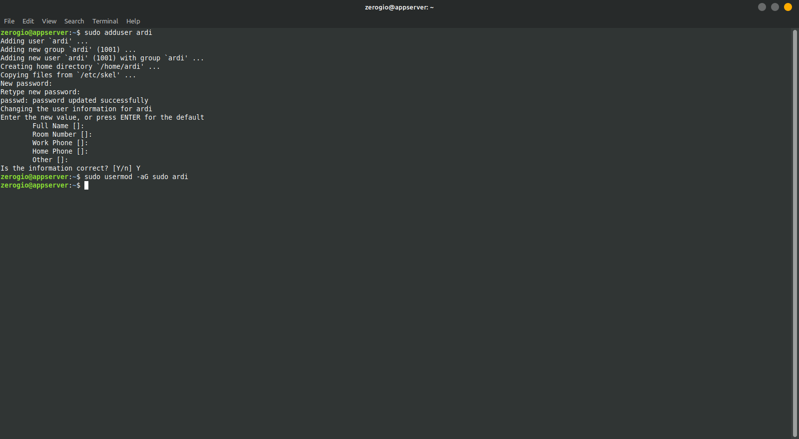

8. Login ke dalam user yang sudah dibuat, untuk pengaturan ssh dapat dilihat pada [ssh-key-configuration](ssh-key-configuration.md).
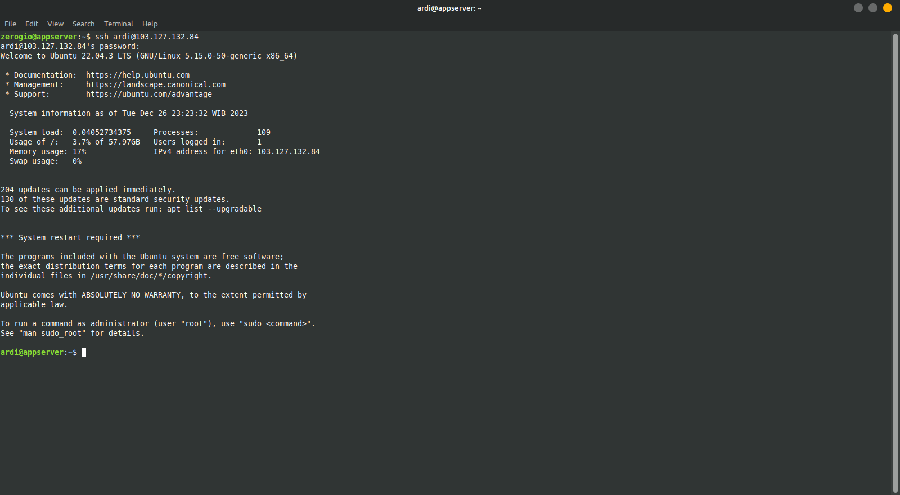

9. Lakukan instalasi mysql yang akan digunakan sebagai database.
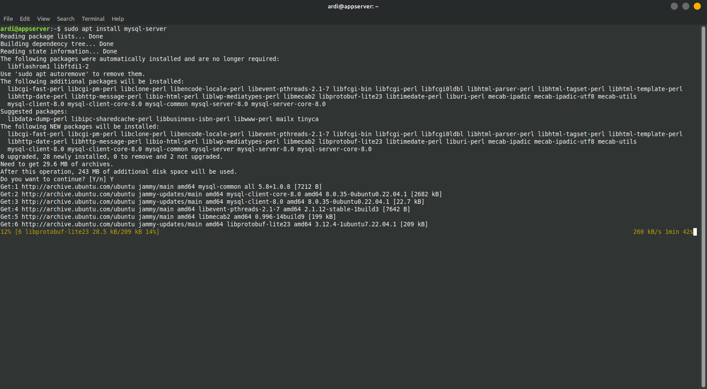

10. Lakukan install nvm yang akan digunakan oleh aplikasi dengan perintah :

    curl -o- https://raw.githubusercontent.com/nvm-sh/nvm/v0.39.7/install.sh | bash

    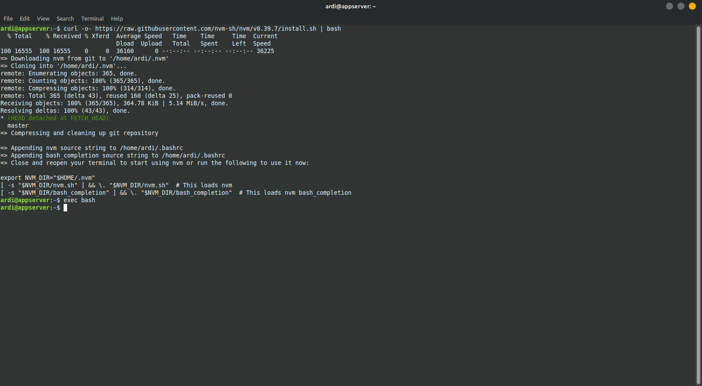

    Lakukan install node versi 14 yang akan digunakan aplikasi dengan perintah : 

    nvm install 14

    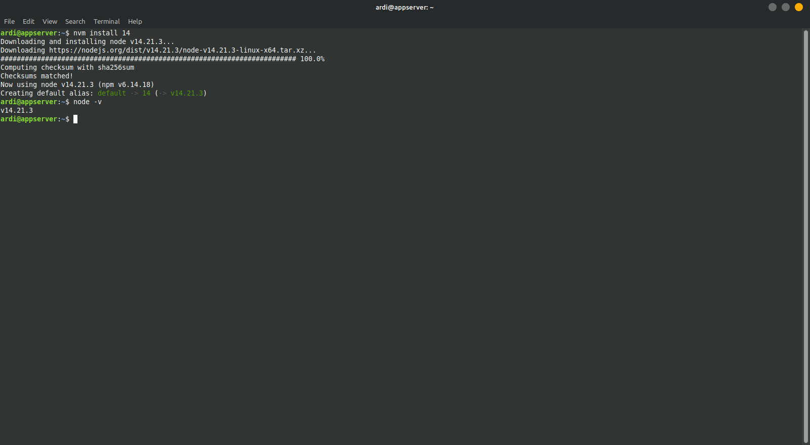

11. Install PM2 yang akan digunakan untuk menjalankan aplikasi secara background dengan perintah :

    npm install pm2 -g

    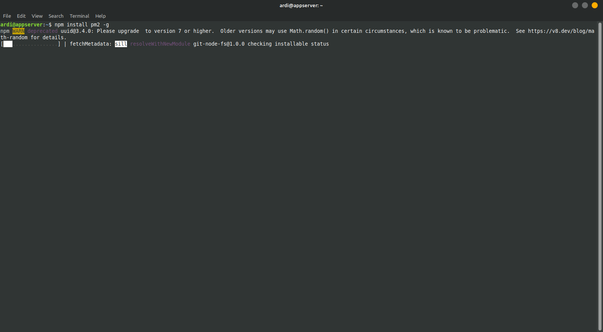

12. Install sequelize-cli yang akan digunakan untuk migrasi backend ke database dengan perintah : 

    npm install --save-dev sequelize-cli

    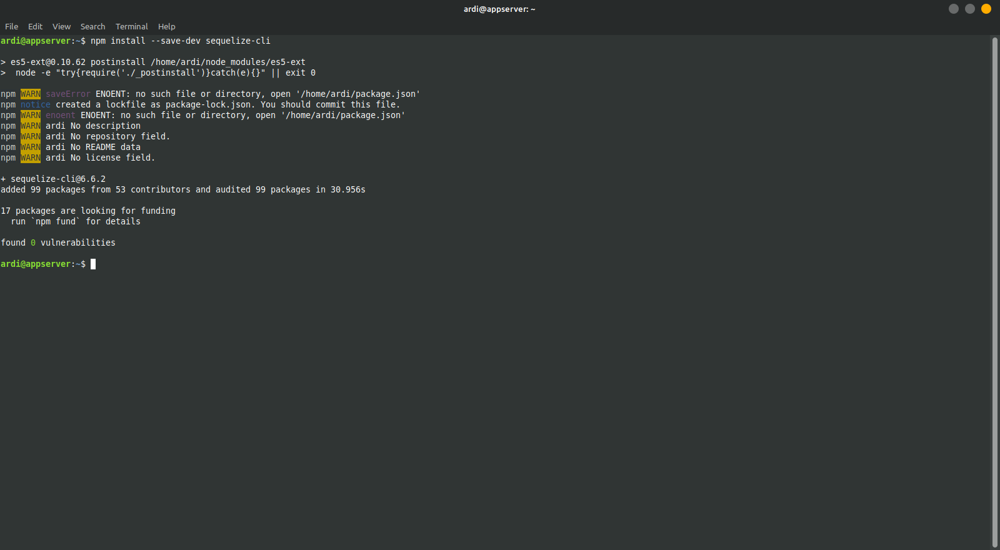

13. Install Certbot untuk melakukan generate certificate SSL

    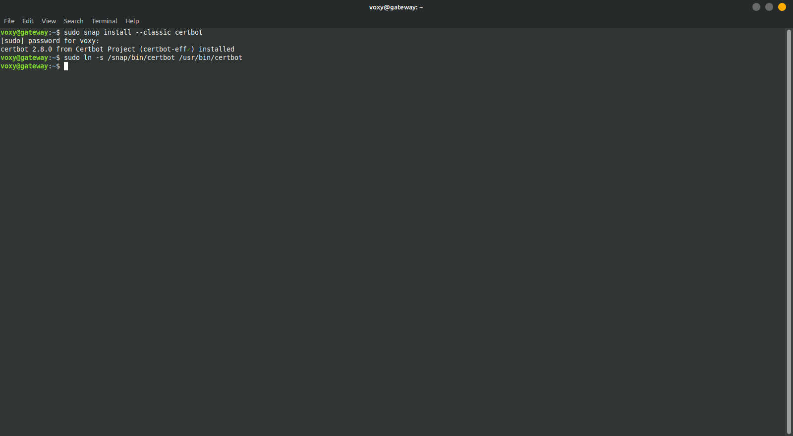

Jika server serta aplikasi yang dibutuhkan sudah siap, maka tinggal melakukan deploy aplikasi. Dokumentasi langkah-langkah deploy dapat dilihat pada [deploy-application&configuration](deploy-application&configuration.md)


