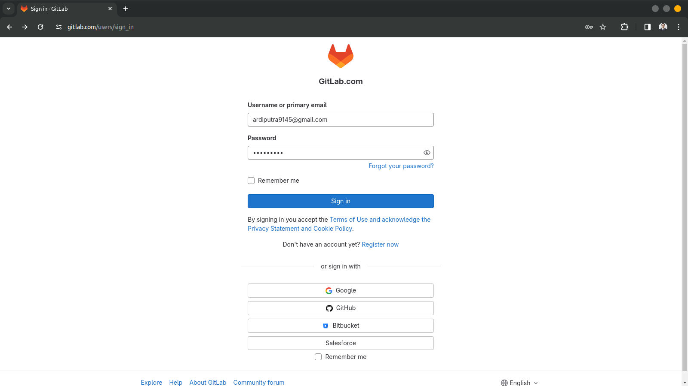
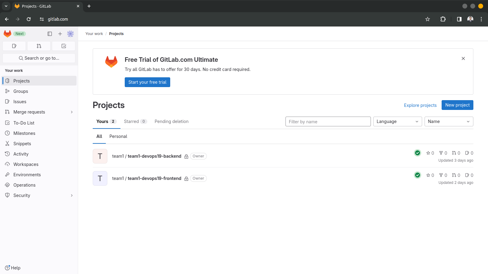
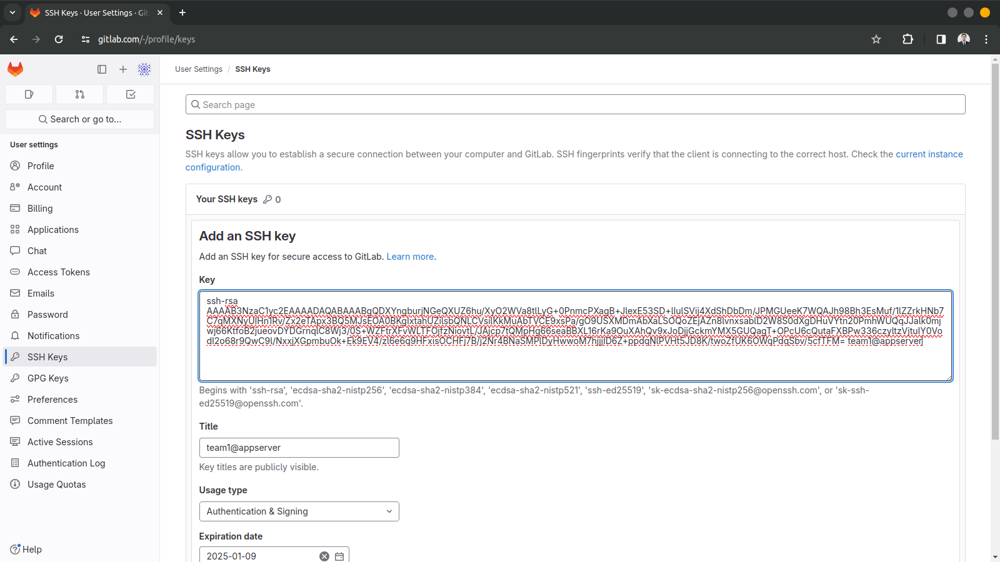
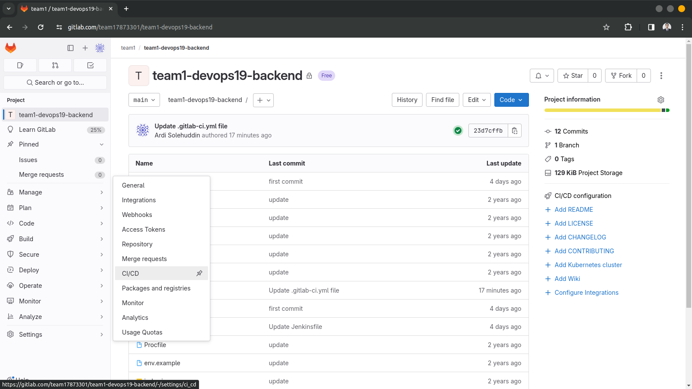
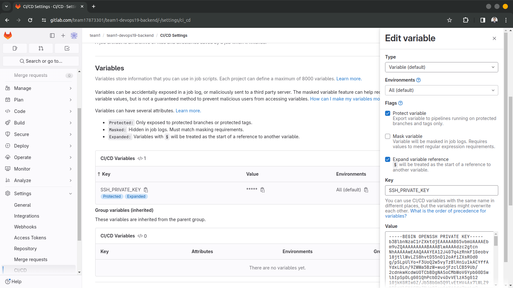
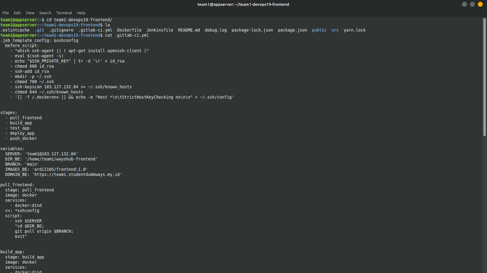
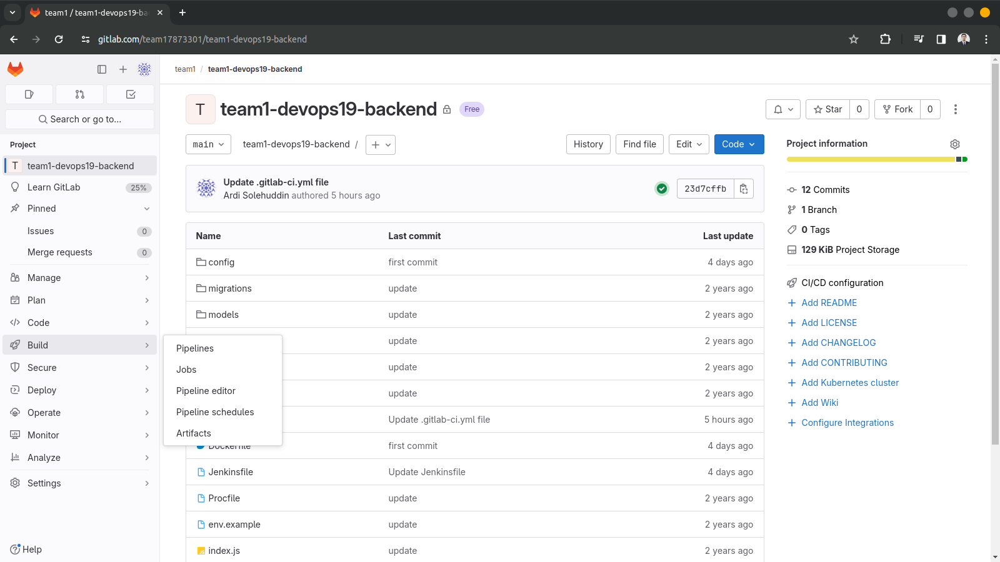
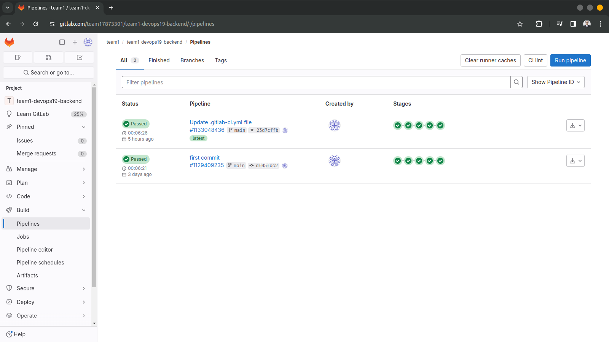

##  Sourcer Code Management Menggunakan GitLabci
Berikut adalah dokumentasi langkah langkah bagaimana melakukan rebuild VM di Biznetgio serta instalasi jenkins on top docker serta membuat pipeline pada jenkins untuk menjalankan aplikasi-aplikasi yang dibutuhkan.

- Buat akun di gitlab.com
- Push SCM dari local-server ke gitlab
- Membuat beberapa Job menggunakan gitlabci untuk aplikasi:
    - Job Frontend
    - Job Backend
    - Script CICD atur flow pengupdate an aplikasi mencakup
        - Pull dari repository
        - Dockerize/Build aplikasi kita
        - push image ke docker hub
        - Test application
        - pull new image
        - Deploy application

1. Login ke gitlab menggunakan email atau dapat membuat akun baru.
 

2. Masukan aplikasi ke dalam repository GitLab serta dapat diremote oleh server 
 

3. Menambahkan SSH key agar server dapat terhubung ke repository gitlab.
 

4. Masuk ke dalam setting CICD untuk menambahkan SSH Private key yang berguna agar gitlab dapat terhubung ke server.
 
 

6. Membuat script gitlab untuk backend dan frontend
 
 

8. Lakukan build untuk menajalankan Gitlabci pipeline
 
