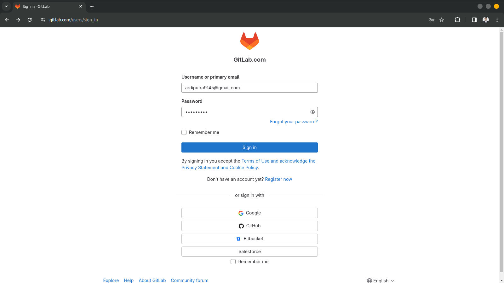
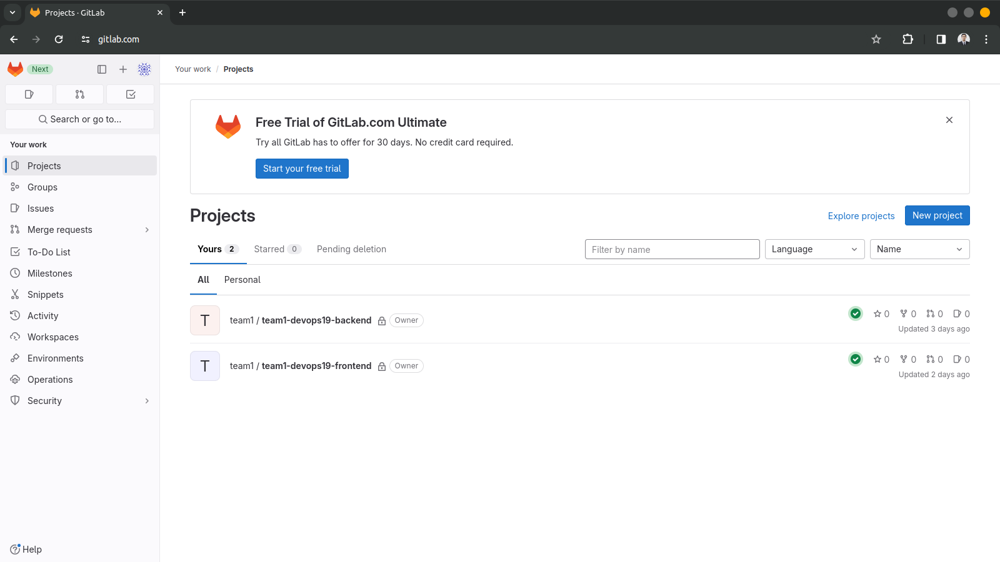
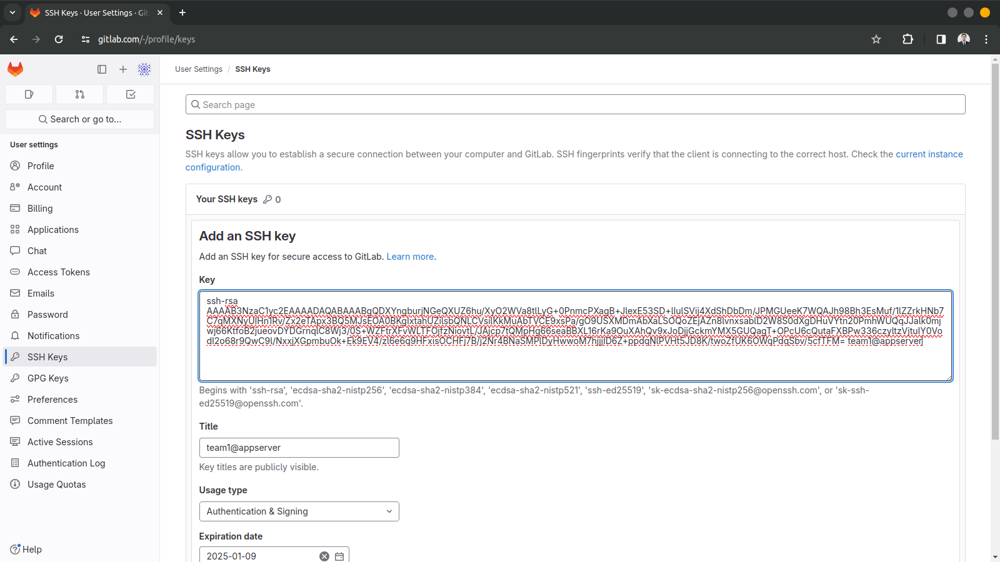
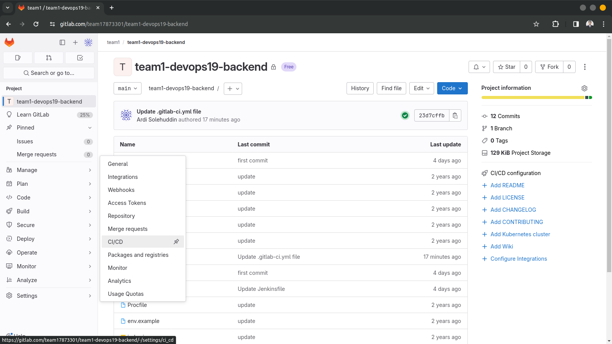
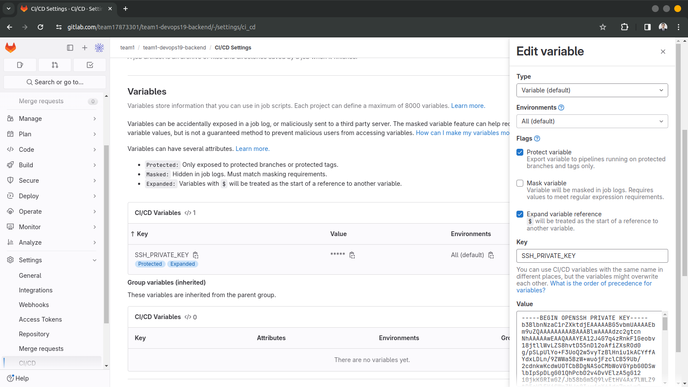
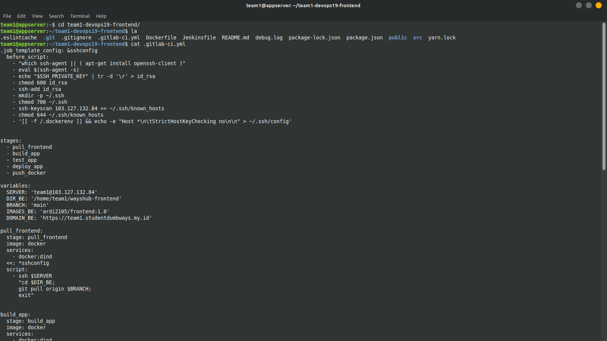
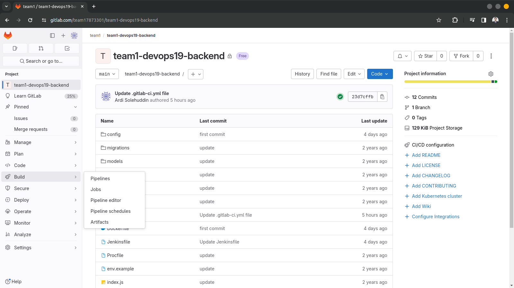

##  Sourcer Code Management Menggunakan GitLabci

### GitLab
GitLab adalah sebuah platform kolaborasi untuk pengembangan perangkat lunak yang menggunakan sistem kontrol versi Git. Ini adalah alat yang memungkinkan tim pengembang untuk bekerja sama dalam proyek perangkat lunak, mengelola kode sumber, dan melacak perubahan yang dibuat pada kode tersebut. Berikut adalah beberapa fitur dan komponen utama dari GitLab:
1. Repository Management
2. Issue Tracking
3. Continuous Integration (CI) / Continuous Deployment (CD)
4. Code Review

### Langkah Pengerjaan
Berikut adalah dokumentasi langkah langkah bagaimana membuat pipeline pada gitlab untuk menjalankan aplikasi-aplikasi yang dibutuhkan dan membuat suatu automation menggunakan gitlab sehingga ketika terdapat perubahan pada source code akan secara otomatis mentrigger gitlab pipeline.

- Buat akun di gitlab.com
- Push SCM dari local-server ke gitlab
- Membuat beberapa Job menggunakan gitlabci untuk aplikasi:
    - Job Frontend
    - Job Backend
    - Script CICD atur flow pengupdate an aplikasi mencakup
        - Pull dari repository
        - Dockerize/Build aplikasi kita
        - push image ke docker hub
        - Test application
        - pull new image
        - Deploy application

1. Login ke gitlab menggunakan email atau dapat membuat akun baru.
 

1. Masukan aplikasi ke dalam repository GitLab serta dapat diremote oleh server 
 

1. Menambahkan SSH key agar server dapat terhubung ke repository gitlab.
 

1. Masuk ke dalam setting CICD untuk menambahkan SSH Private key yang berguna agar gitlab dapat terhubung ke server.
 
 

1. Membuat script gitlab untuk backend dan frontend
 
 

1. Lakukan build untuk menajalankan Gitlabci pipeline
 
