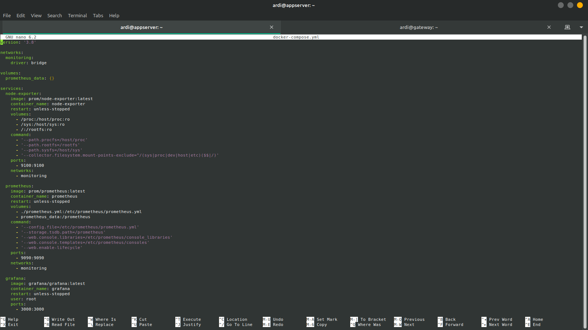
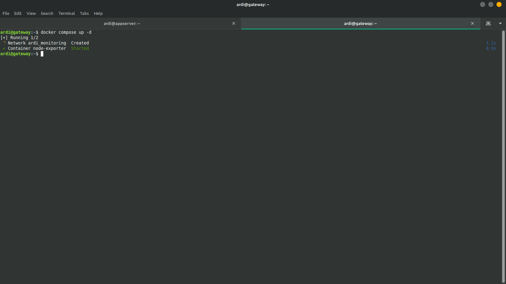
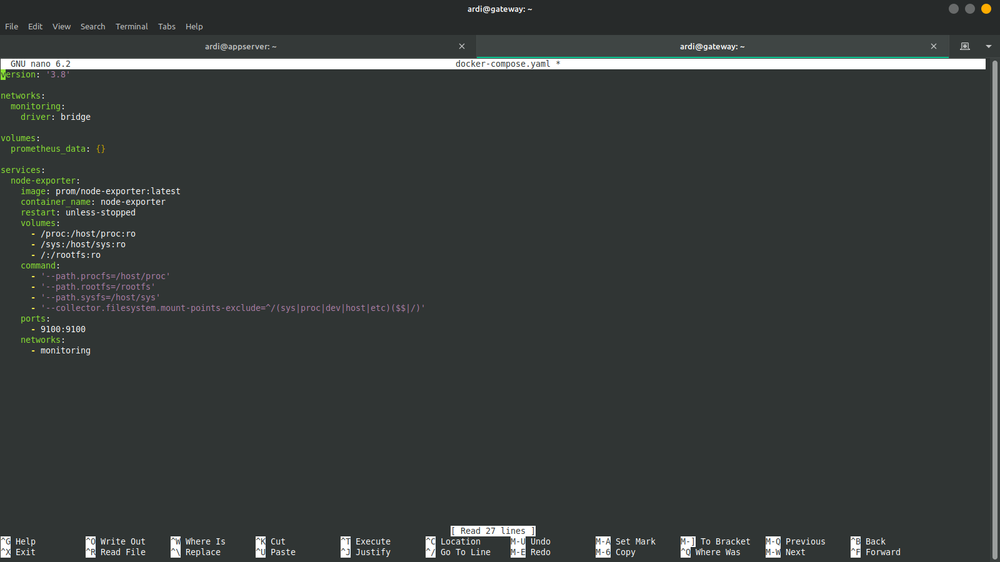
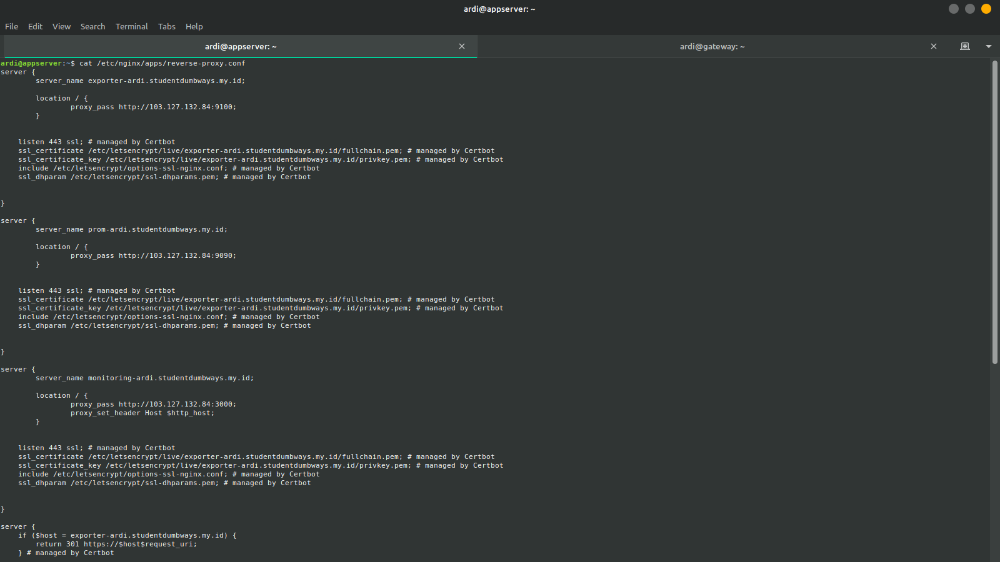
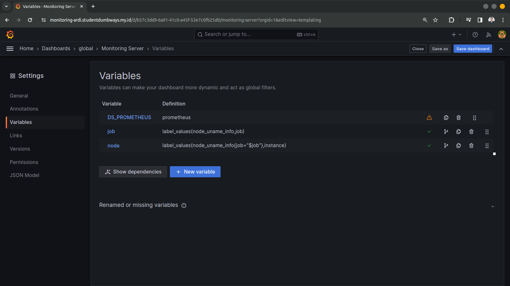
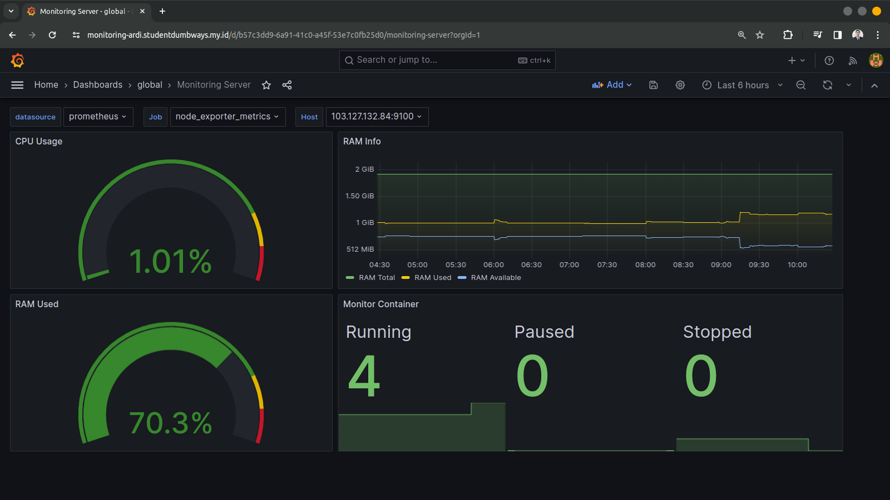
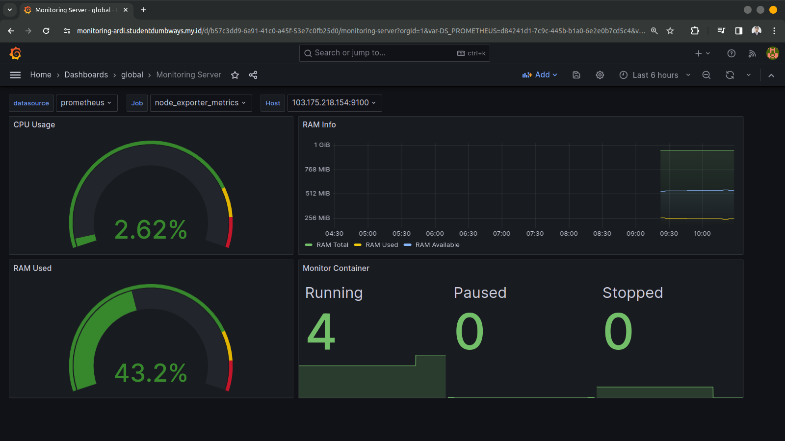
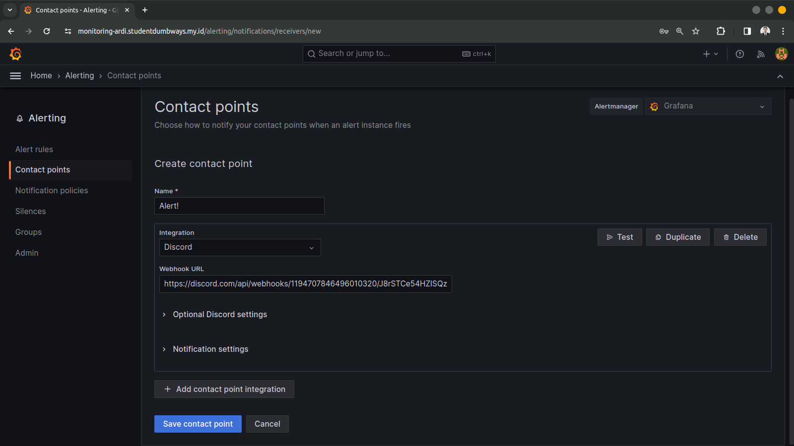
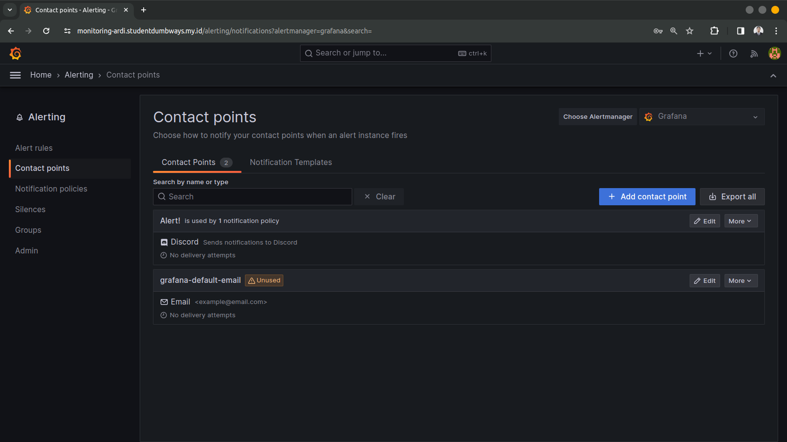
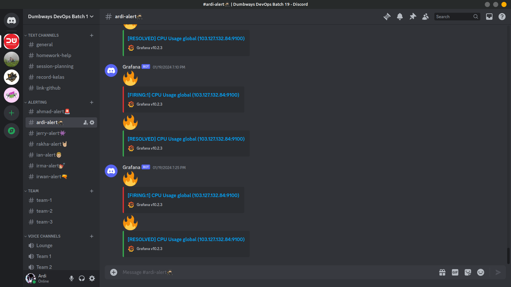

##  Ansible And Ansible Playbook
Berikut adalah dokumentasi langkah langkah bagaimana melakukan monitoring server serta container menggunakan Grafana, Prometheus serta Node exporter dan konfigurasi untuk memberi notifikasi jika terdapat server overload cpu usage dan ram usage ke discord.

1. Langkah pertama adalah melakukan set up node exporte, prometheus serta grafana menggunakan docker compose pada server appserver lalu nyalakan.

2. Selanjutnya set up node exporter menggunakan docker compose pada server gateway agar dapat dimonitor.

3. Membuat reverse proxy agar setiap aplikasi berjalan dapat diakses menggunakan domain serta memberi ssl certificate agar berjalan di atas https.

4. Selanjutnya membuat variables agar dapat  untuk melakukan monitoring RAM CPU serta container pada tiap server

    |  |
    |:--:|
    | *Monitoring Appserver* |

    |  |
    |:--:|
    | *Monitoring Gateway* |

5. Langkah selanjutnya adalah membuat discord notifier agar dapat memberikan notifikasi saat terdapat RAM atau CPU usage berlebih.
 
 
