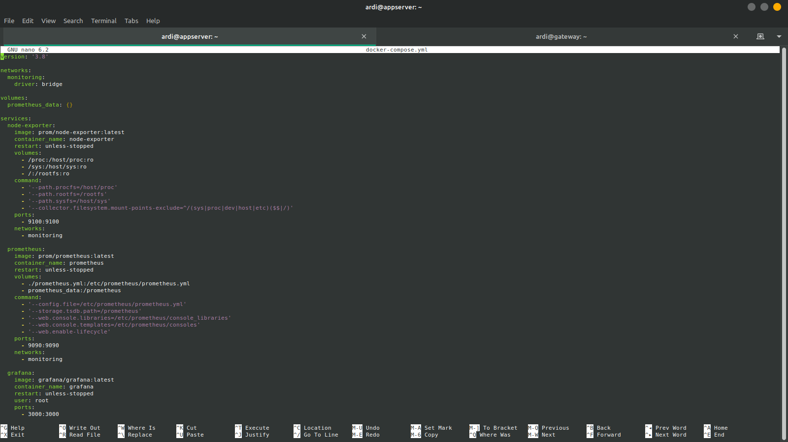
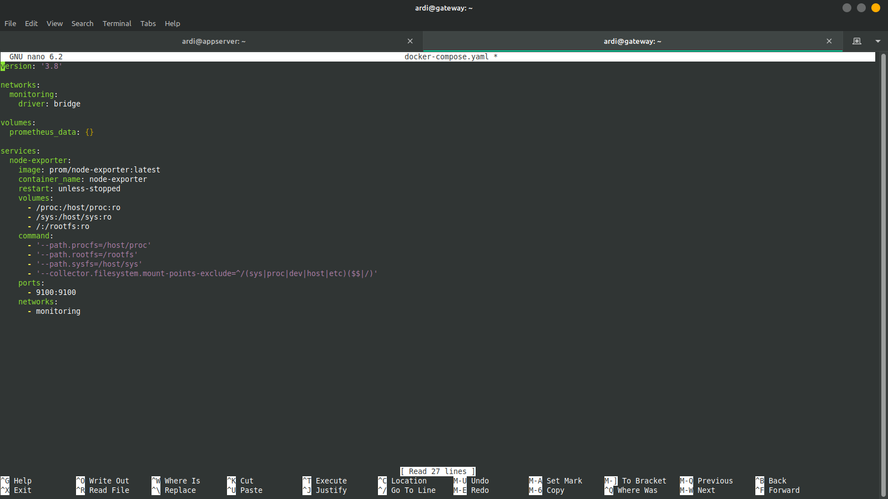
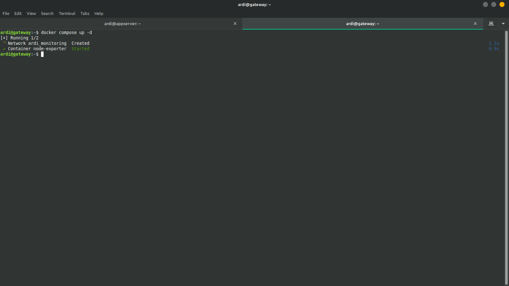
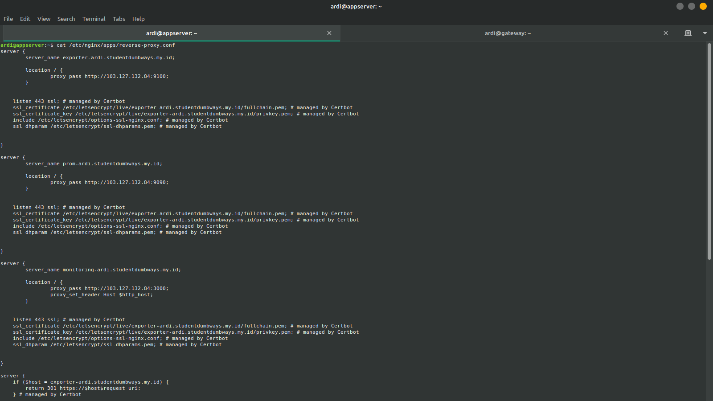
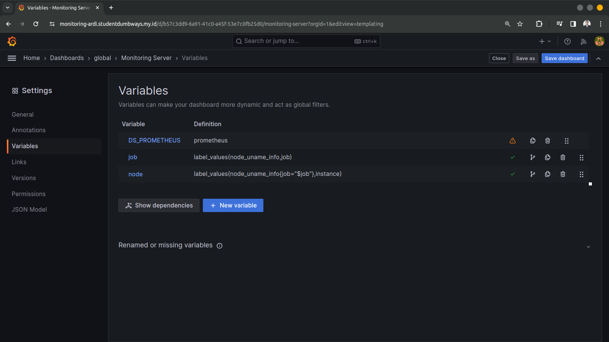
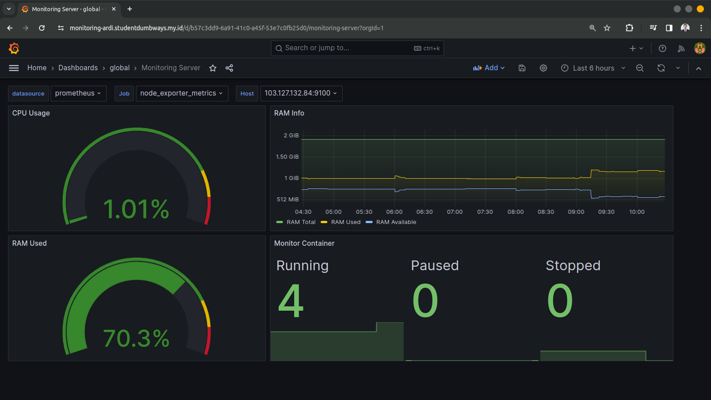
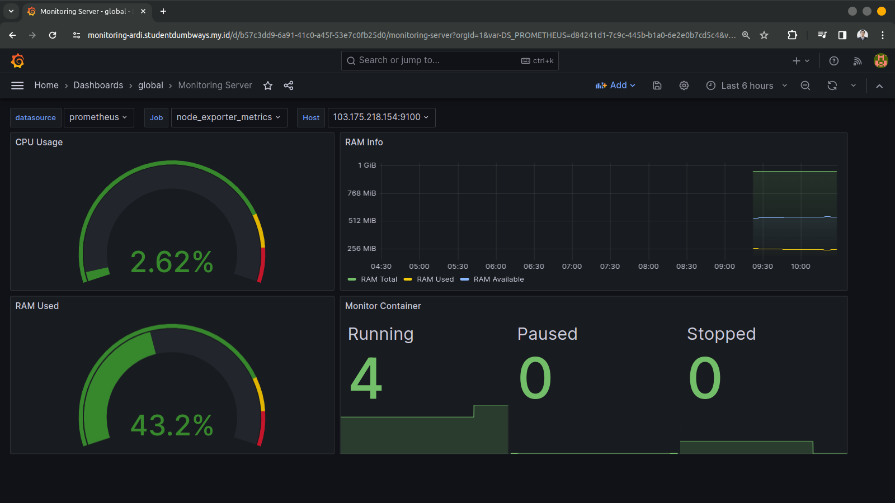
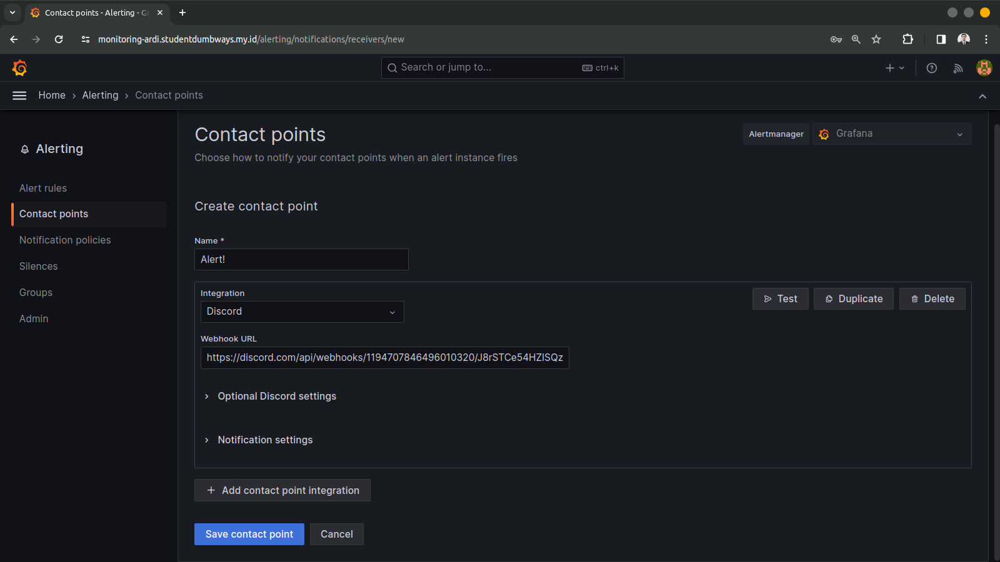
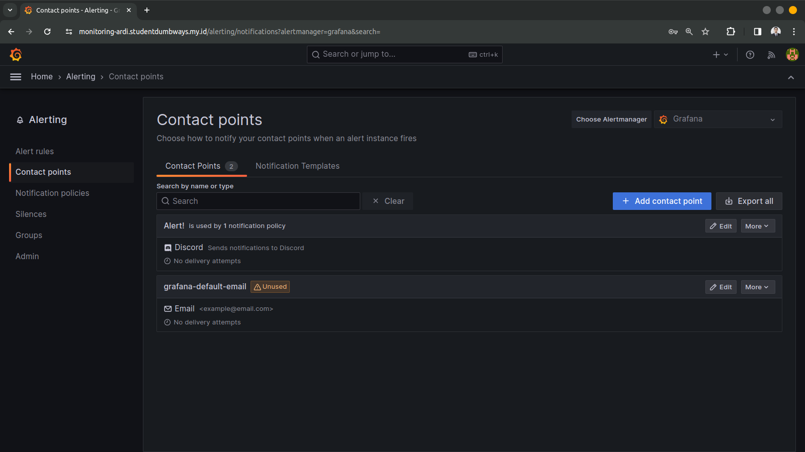
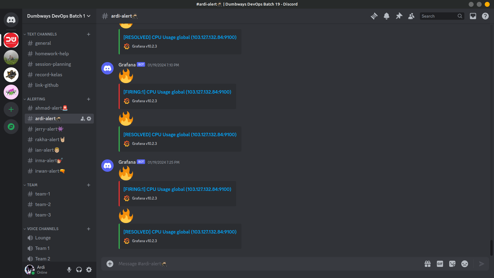

##  Monitoring Menggunakan Graphana, Prometheus dan Node Exporter

### Prometheus, Node Exporter dan Grafana
**Prometheus** adalah sistem pemantauan open-source yang awalnya dikembangkan oleh SoundCloud. Ini dirancang untuk memantau dan mengumpulkan metrik dari lingkungan infrastruktur yang berjalan, seperti server, aplikasi, layanan, dan sebagainya.

**Node Exporter** adalah komponen tambahan yang digunakan bersama dengan Prometheus. Ini adalah agen yang diinstal pada setiap host atau node yang ingin dimonitor, dan bertanggung jawab untuk mengumpulkan dan mengekspos metrik sistem dari host tersebut.

**Grafana** adalah platform visualisasi data open-source yang dirancang untuk membuat dashboard dan menggambarkan data metrik dari berbagai sumber, termasuk Prometheus. Dengan Grafana, pengguna dapat membuat dashboard yang menarik dan informatif dengan grafik, grafik, dan panel data lainnya.

Secara keseluruhan, Prometheus digunakan untuk mengumpulkan dan menyimpan data metrik, Node Exporter digunakan untuk mengumpulkan metrik dari host yang dimonitor, dan Grafana digunakan untuk memvisualisasikan data metrik ini dalam bentuk dashboard yang interaktif dan informatif. Kombinasi dari ketiga alat ini memberikan kemampuan yang kuat untuk memantau, menganalisis, dan memahami kinerja sistem dan aplikasi dalam lingkungan infrastruktur apa pun.

### Langkah Pengerjaan
Berikut adalah dokumentasi langkah langkah bagaimana melakukan monitoring server serta container menggunakan Grafana, Prometheus serta Node exporter dan konfigurasi untuk memberi notifikasi jika terdapat server overload cpu usage dan ram usage ke discord.
1. Langkah pertama adalah melakukan set up node exporter, prometheus serta grafana menggunakan docker compose pada server appserver lalu jalankan dengan perintah `docker compose up -d`.

1. Selanjutnya set up node exporter menggunakan docker compose pada server gateway agar dapat dimonitor, yaitu di mana prometheus akan melakuakn scrape data dari node exporter.

1. Membuat reverse proxy agar setiap aplikasi berjalan dapat diakses menggunakan domain serta memberi ssl certificate agar berjalan di atas https.

1. Selanjutnya membuat variables agar dapat melakukan monitoring RAM CPU serta container pada tiap server

    |  |
    |:--:|
    | *Monitoring Appserver* |

    |  |
    |:--:|
    | *Monitoring Gateway* |

1. Langkah selanjutnya adalah membuat discord notifier agar dapat memberikan notifikasi saat terdapat penggunaan RAM atau CPU berlebih.
 
 
