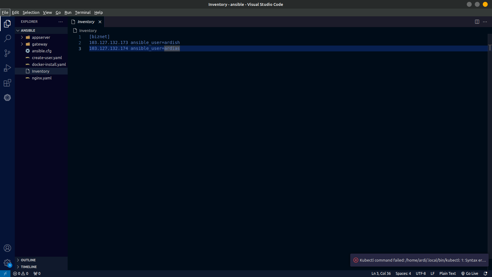
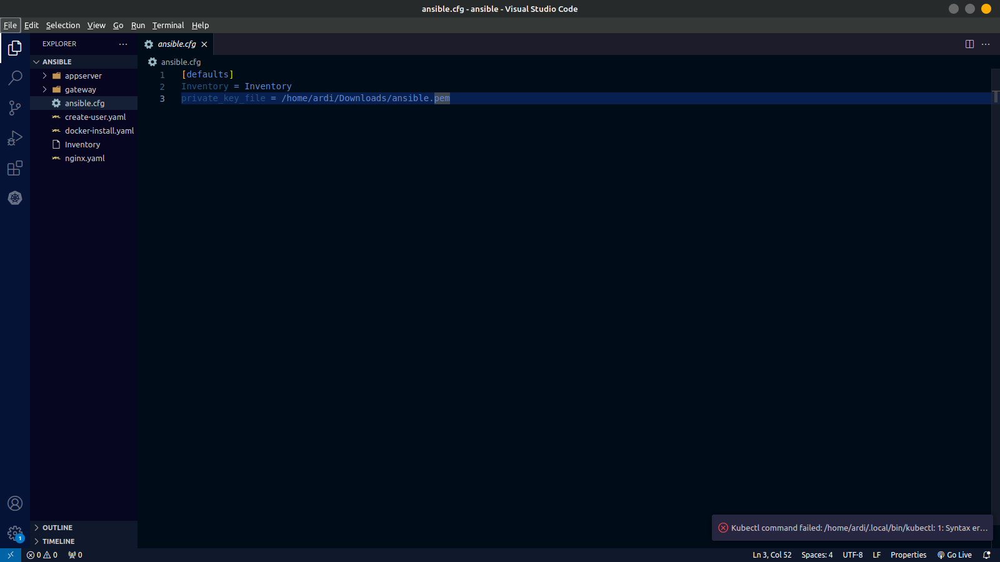
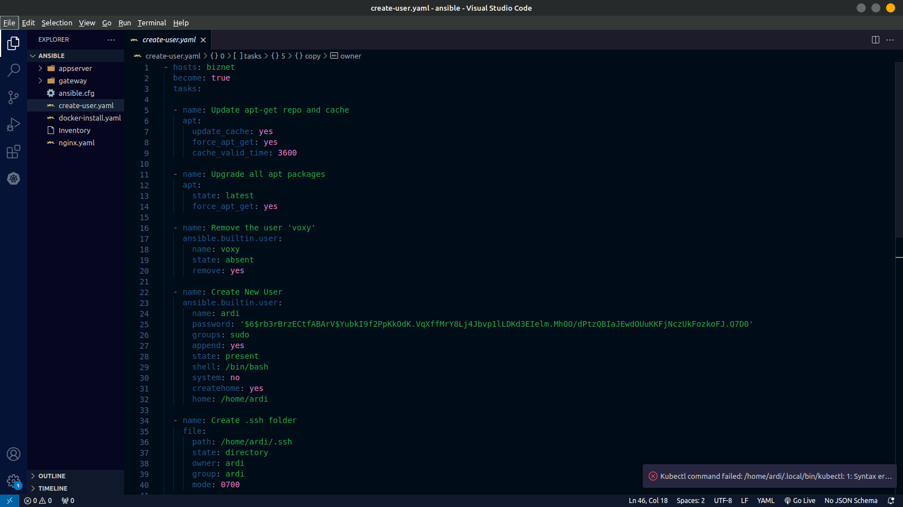
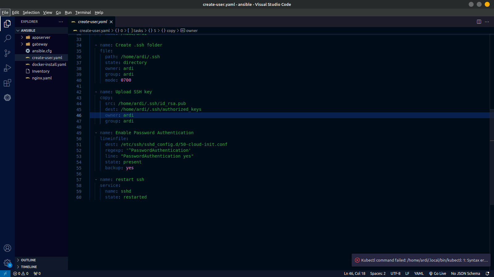
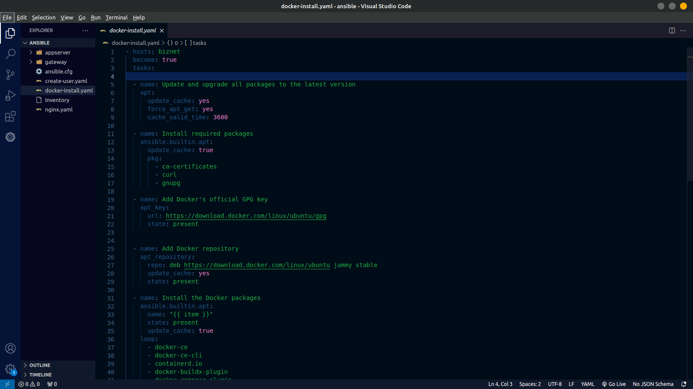
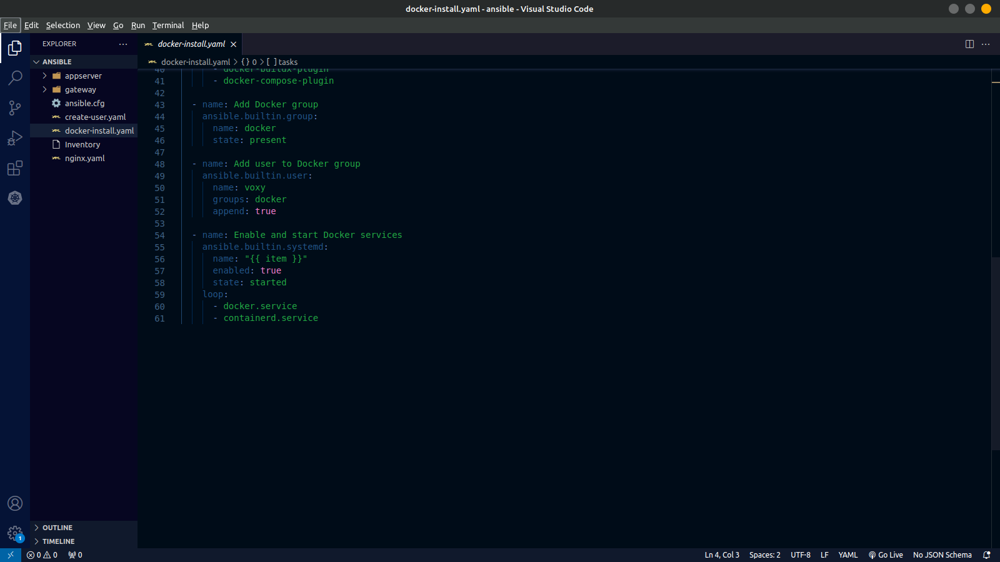
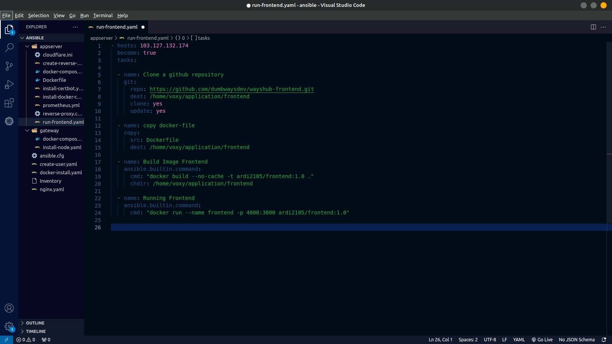
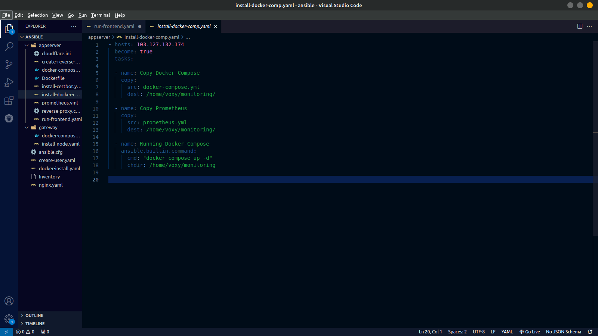
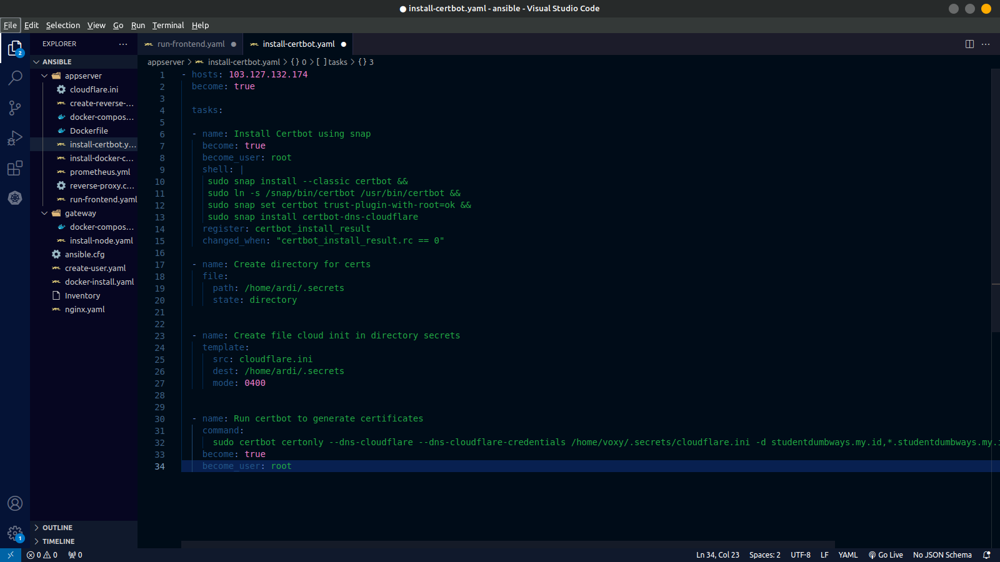

##  Ansible And Ansible Playbook
Berikut adalah dokumentasi langkah langkah bagaimana menggunakan ansbile untuk melakukan baik instalasi aplikasi, konfigurasi serta beberapa fungsi lainnya ke beberapa server sekaligus.

1. Langkah pertama siapkan terlebih dahulu inventory yang berguna untuk meyimpan data server yang akan diremote menggunakan ansbile.
 

2. Buat file config untuk membuat script yang akan mengarah ke file ssh sehingga server local bisa terhubung ke server menggunakan ssh key
 

3. Membuat script untuk membuat sebuah user baru yang disertai dengan settingan untuk membuat server dapat diakses menggunakan password atau ssh key.
 
 

4. Membuat script yang digunakan untuk melakukan docker install untuk kedua server 
 
 

7. Melakukan deploy aplikasi frontend menggunakan script ansbile dengan melakukan pulling dari repository dan menyiapkan dockerfile yang akan dimasukan ke dalam folder aplikasi frontend.
 

8. Membuat script untuk melakukan instalasi tools monitoring yaitu dengan menyiapkan docker compose file yang akan dimasukan ke dalam server dan dijalankan.
 

9. Membuat script  instalasi certbot untuk melakukan generate ssl certificate.
