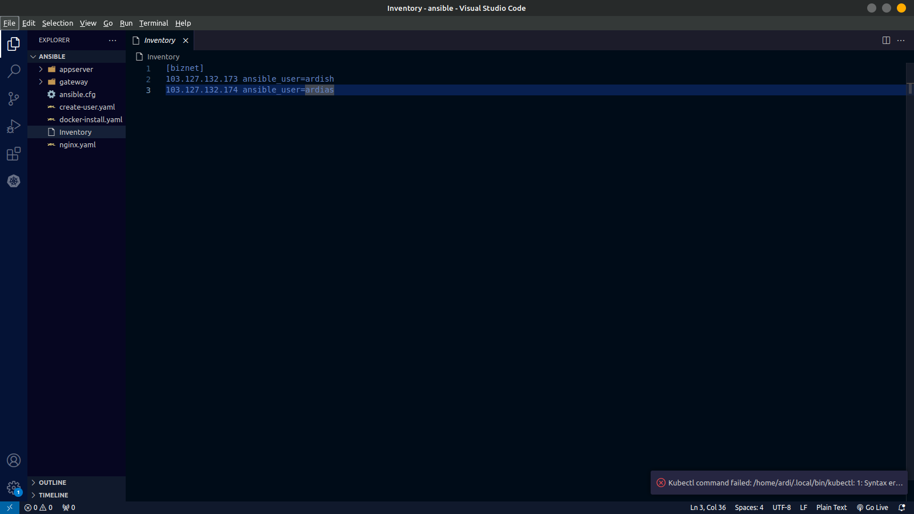
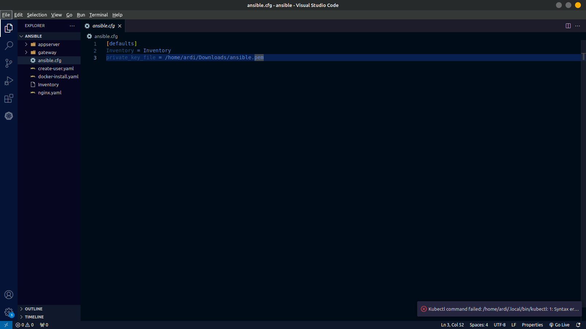
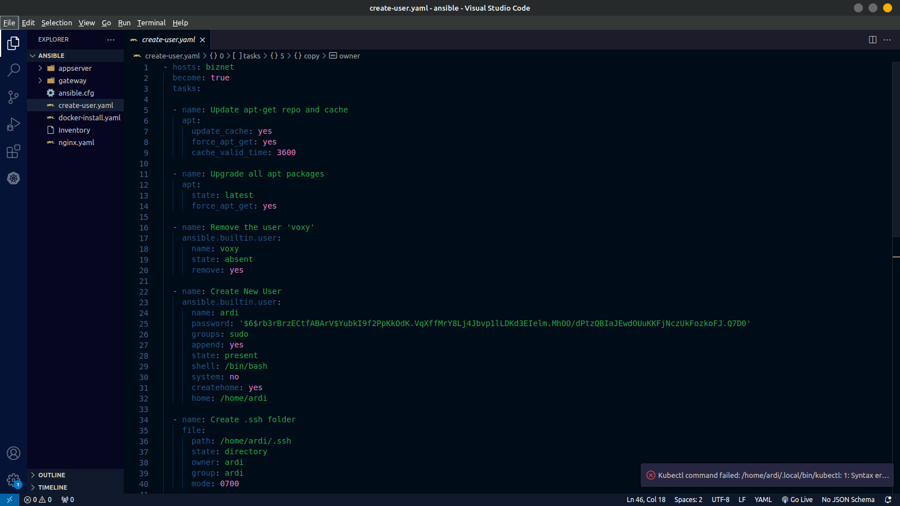
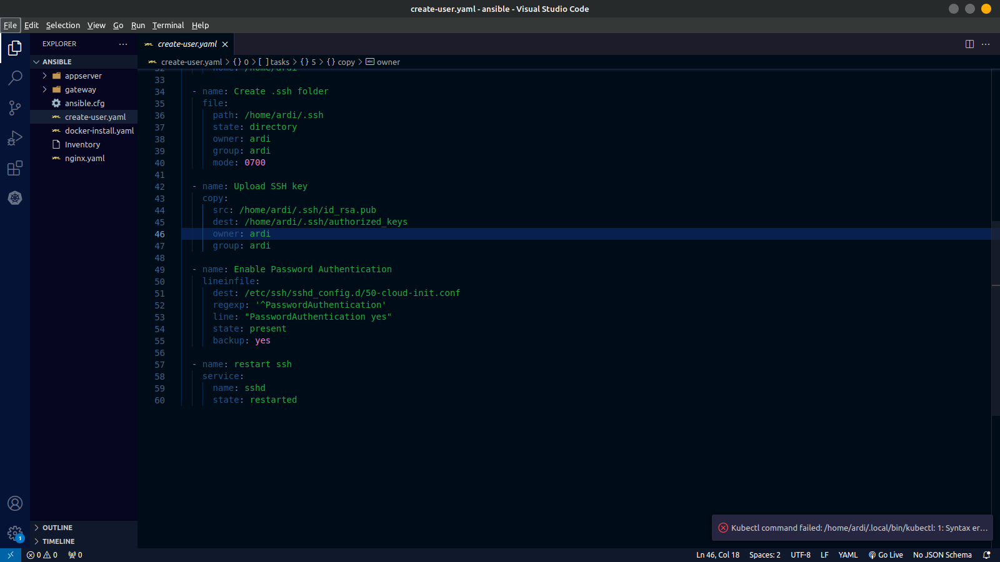
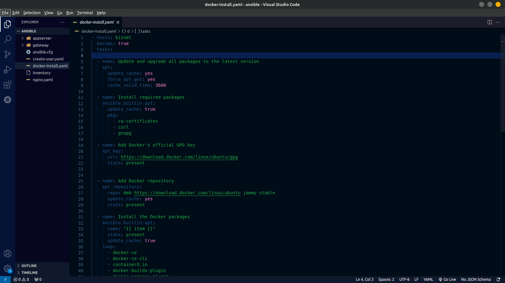
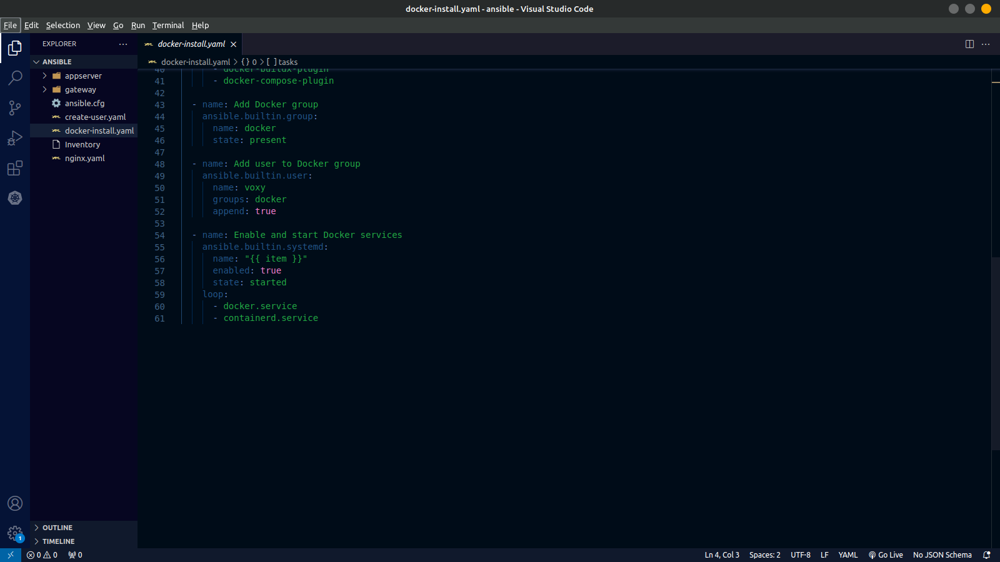
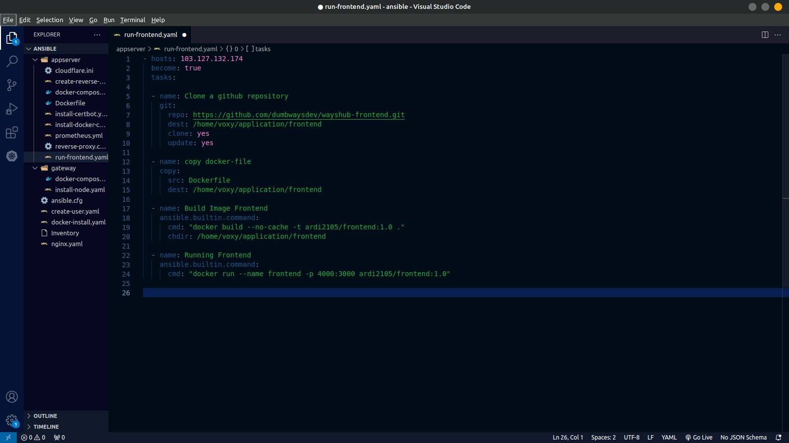
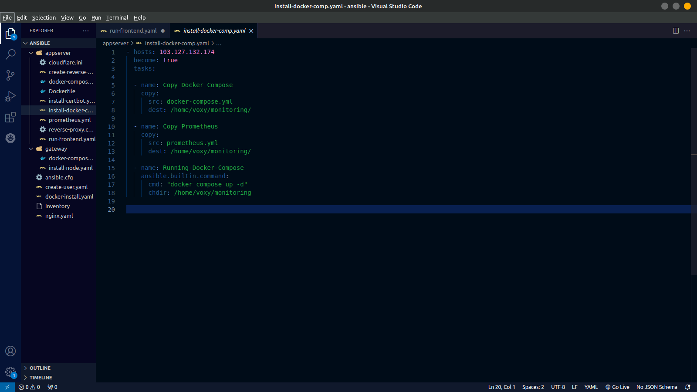
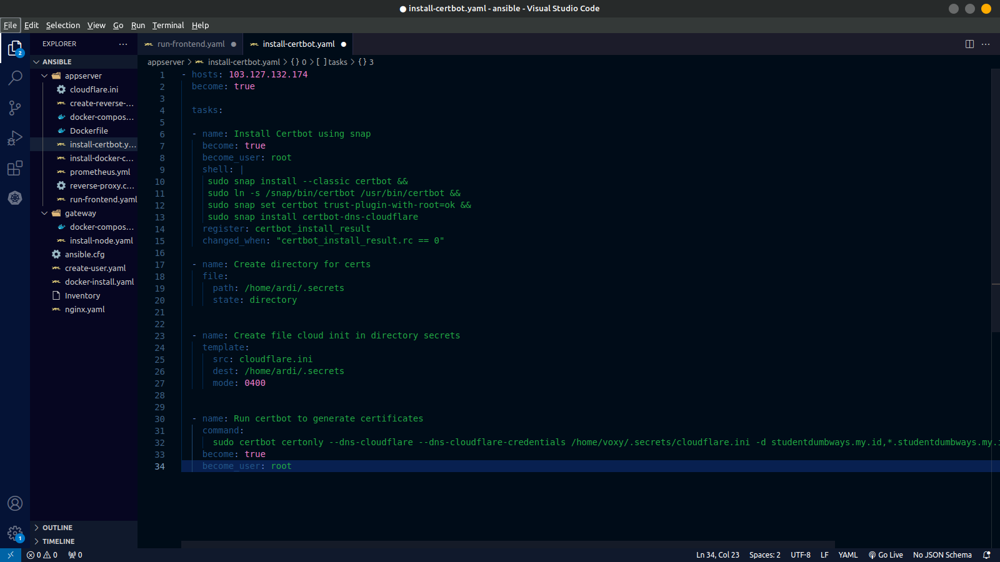

##  Ansible And Ansible Playbook

### Ansible
Ansible adalah platform otomatisasi IT yang populer yang digunakan untuk menyederhanakan, mengotomatiskan, dan mengelola infrastruktur dan aplikasi perangkat lunak secara efisien. Ini bekerja dengan cara mendeklarasikan konfigurasi infrastruktur sebagai kode, yang memungkinkan untuk mendefinisikan, menyebarkan, dan mengelola infrastruktur dengan mudah dan konsisten. Ansible menggunakan file YAML yang disebut "playbooks" untuk mendefinisikan tugas-tugas dan konfigurasi sistem. Playbooks menyatakan serangkaian langkah-langkah yang harus diambil oleh Ansible untuk menyebarkan, mengonfigurasi, atau mengelola infrastruktur. Ini membuat konfigurasi dan otomatisasi sistem sangat mudah dipahami dan dikelola.

### Langkah Pengerjaan
Berikut adalah dokumentasi langkah langkah bagaimana menggunakan ansible untuk melakukan baik instalasi aplikasi, konfigurasi serta beberapa fungsi lainnya ke beberapa server sekaligus.

1. Langkah pertama siapkan terlebih dahulu inventory yang berguna untuk meyimpan data server yang akan diremote menggunakan ansbile.
 

2. Buat file config untuk membuat script yang akan mengarah ke file ssh sehingga server local bisa terhubung ke server menggunakan ssh key
 

3. Membuat script untuk membuat sebuah user baru yang disertai dengan settingan untuk membuat server dapat diakses menggunakan password atau ssh key.
 
 

4. Membuat script yang digunakan untuk melakukan docker install untuk kedua server 
 
 

7. Melakukan deploy aplikasi frontend menggunakan script ansbile dengan melakukan pulling dari repository dan menyiapkan dockerfile yang akan dimasukan ke dalam folder aplikasi frontend.
 

8. Membuat script untuk melakukan instalasi tools monitoring yaitu dengan menyiapkan docker compose file yang akan dimasukan ke dalam server dan dijalankan.
 

9. Membuat script  instalasi certbot untuk melakukan generate ssl certificate.
