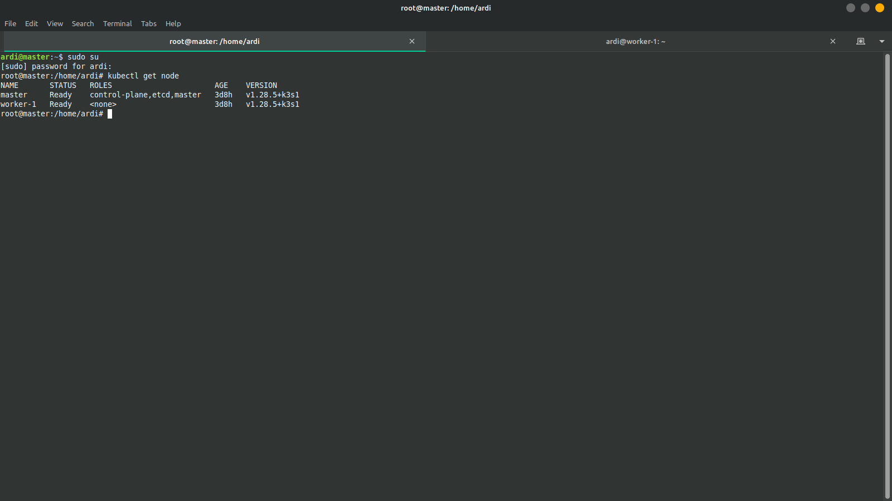
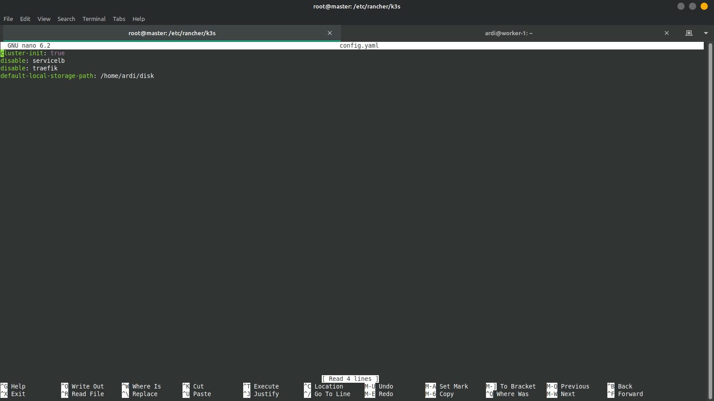
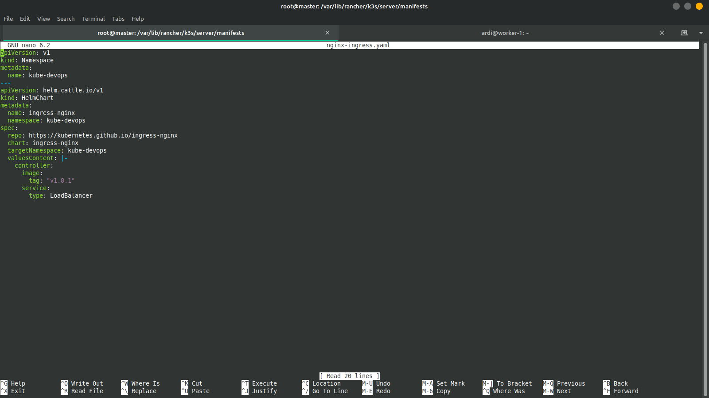
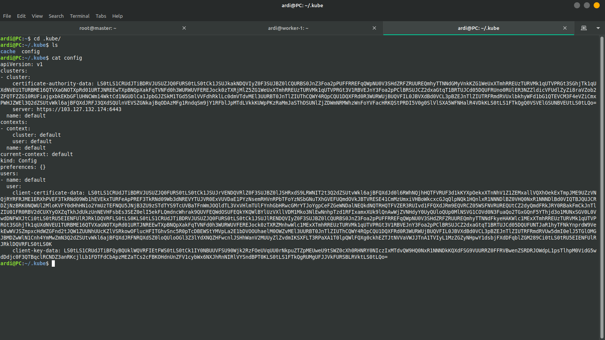
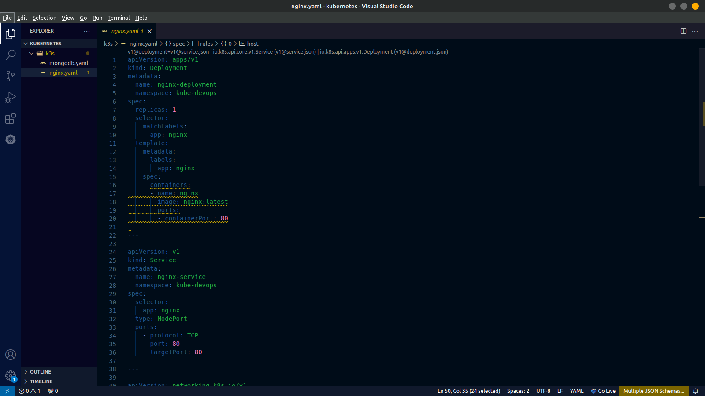
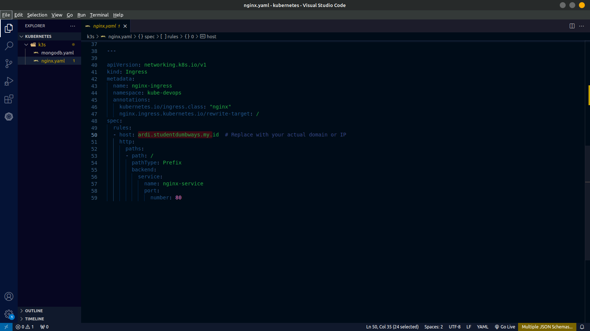
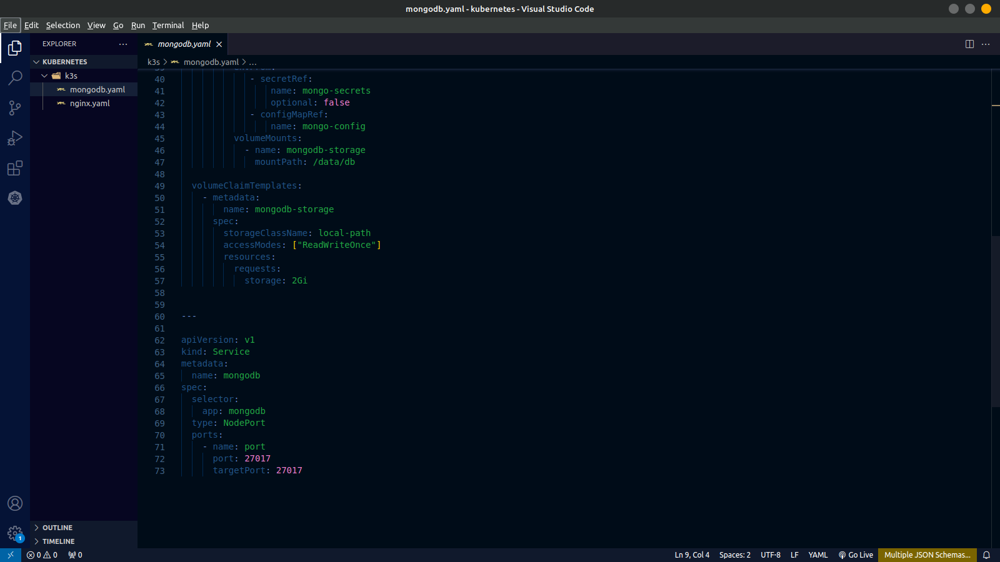
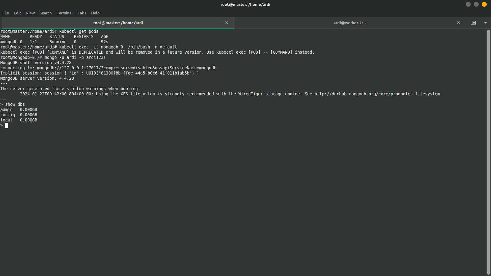

##  Membuat Cluster Menggunakan Kubernetes
Berikut adalah dokumentasi langkah langkah bagaimana membuat suatu cluster dengan kubernets, melakukan uninstall ingress traefik, install ingress serta melakukan deploy aplikasi.

- Membuat sebuah cluster menggunakan k3s yang berisikan 2 node as a master and worker.
- Install ingress nginx using manifest
- Deploy aplikasi nginx lalu membuat suatu ingress yang mengarah ke aplikasi nginx.
- Setup persistent volume on k3s config
- Deploy aplikasi mongodb database on top kubernetes, menggunakan statefull.set dan juga pasangkan pvc ke dalamnya
- Membuat database di mongodb dan isi dummy data

1. Pertama buat sebuah node atau server yang masing masing berperan sebagai master dan worker/slave
 

2. Unistal atau disable ingress traefik bawaan kubernets dengan membuat file config.yaml di didirectory `/etc/rancher/k3s# pwd` yang akan secara otomats berjalan melakukan disable traefik.
 

3. Melakukan install ingress nginx dengan membuat script ingress-nginx.yaml pada directory `/var/lib/rancher/k3s/server/manifests` yang akan secara otomatis juga melakukan install
 

4. Lakukan remote kubernetes agar dapat membuat script atau melakukan konfigurasi melalui local dengan membuat directory `.kube` dan memasukan isi file config kubernetes yang berada pada direktori `/etc/rancher/k3s/k3s.yaml` yang kemudia ubah localhost menjadi server kubernets yang akan diremote. 
 

5. Melakukan instalasi nginx menggunakan vscode
 
 

6. Melakukan installasi mongodb menggunakan vscode
 
 

7. Dapat dilihat bahwa mongodb sudah berhasil berjalan pada kubernetes.
