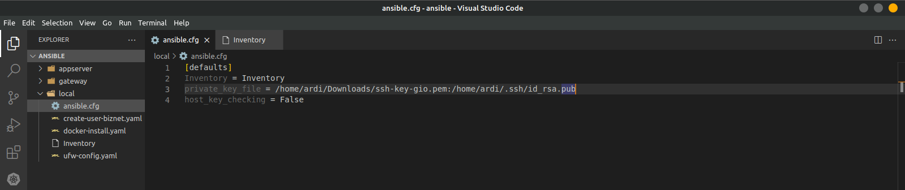
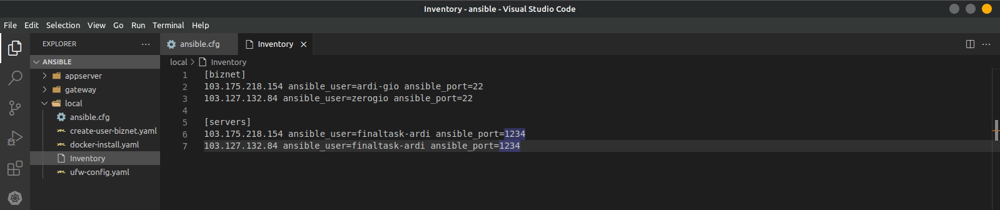

## Provisioning
### Menyiapkan server menggunakan ansible

**Requirements**
- Local machine w/ Ansible
- Biznet GIO NEO Lite Servers
  - Appserver - 2 CPU, 2GB RAM
  - Gateway - 1 CPU, 1GB RAM

**Instructions**
- Attach SSH keys & IP configuration to all VMs
- Server Configuration using Ansible:

[ *All Servers* ]
- Docker Engine
- Node Exporter

[ *Appserver* ]
  - git repo 
  - Prometheus & Grafana

[ *Gateway* ]
  - NGINX/Apache2/Lightspeed
  - Reverse Proxy
  - Wildcard SSL Certificate

## Pembuatan Server Biznet
Berikut adalah dokumentasi pembuatan server biznetgio 

1. Login pada website [BiznetGio](portal.biznetgio.com) atau lakukan pendaftaran akun baru. 
\](<setup-server&install-requirements/biznet account.png>)](<images/biznet account.png>)

2. Jika sudah login, pada tampilan dashboard klik quick create lalu pilih NeoLite. Buat dua buah server dengan nama sesuai ketentuan yaitu Appserver dan Gateway, untuk penjelasan lebih detail cara membuat server di BiznetGIo dapat dilihat di [Server Gateway](../Week-1/Day-1/setup-server.md) dan [Server Appserver](../Week-1/Day-2/setup-server.md)
\](setup-server&install-requirements/quick-create.png)](images/quick-create.png)

## Konfigurasi dan Instalasi Menggunakan Ansible
Dokumentasi konfigurasi server serta instalasi alat yang dibutuhkan untuk deploy aplikasi menggunakan ansible.

### Allserver
Pada semua server dilakukan instalasi docker. 

1. Membuat file ansible.cfg sebagai script untuk mengarahkan file ssh key yang akan digunakan agar ansible dapat terhubung ke server serta file Inventory untuk mengarahkan ansible ke server dan host yang akan dikonfigurasi.
   
   

2. Membuat script untuk membuat user pada masing masing server yang telah dibuat sebelumnya dengan serta melakukan setting ssh pada tiap server menggunakan ansbile script berikut:
   ```
    - hosts: biznet
    become: true
    tasks:

    - name: Remove the user 'finaltask-ardi'
      ansible.builtin.user:
        name: finaltask-ardi
        state: absent
        remove: yes

    - name: Update apt-get repo and cache
      apt: 
        update_cache: yes 
        force_apt_get: yes 
        cache_valid_time: 3600

    - name: Upgrade all apt packages
      apt: 
        upgrade: dist
        force_apt_get: yes

    - name: Create New User
      ansible.builtin.user:
        name: finaltask-ardi
        password: '$6$rb3rBrzECtfABArV$YubkI9f2PpKkOdK.VqXffMrY8Lj4Jbvp1lLDKd3EIelm.MhOO/dPtzQBIaJEwdOUuKKFjNczUkFozkoFJ.Q7D0'
        groups: sudo
        append: yes
        state: present
        shell: /bin/bash
        system: no 
        createhome: yes
        home: /home/finaltask-ardi

    - name: Create .ssh folder
      file:
        path: /home/finaltask-ardi/.ssh
        state: directory
        owner: finaltask-ardi
        group: finaltask-ardi
        mode: 0700
        
    - name: Upload SSH Public Key
      copy:
        src: /home/ardi/.ssh/id_rsa.pub
        dest: /home/finaltask-ardi/.ssh/authorized_keys
        owner: finaltask-ardi
        group: finaltask-ardi

    - name: Upload SSH Private Key
      copy:
        src: /home/ardi/.ssh/id_rsa
        dest: /home/finaltask-ardi/.ssh/
        owner: finaltask-ardi
        group: finaltask-ardi
        mode: 0400
    
    - name: Disable Password Authentication
      lineinfile:
        dest: '{{item}}'
        regexp: '^PasswordAuthentication'
        line: "PasswordAuthentication no"
        state: present
        backup: yes
      loop:
        - /etc/ssh/sshd_config
        - /etc/ssh/sshd_config.d/50-cloud-init.conf

    - name: restart ssh
      service:
        name: sshd
        state: restarted
   ```

3. Membuat script untuk melakukan instalasi docker pada masing masing server yang telah dibuat sebelumnya, mengarah pada host biznet pada file inventory.
   ```
    - hosts: biznet
    become: true

    - name: Install Docker with curl

    tasks:
      - name: Download Docker installation script
        shell: "curl -fsSL https://get.docker.com -o get-docker.sh"
        args:
          creates: get-docker.sh  # Memeriksa apakah skrip sudah ada sebelumnya

      - name: Run Docker installation script
        shell: "sh get-docker.sh"
        args:
          chdir: /home/finaltask-ardi # Menggunakan direktori playbook sebagai direktori kerja
        when: "get-docker.sh.stdout.find('Docker version') == -1"  # Memeriksa apakah Docker sudah terinstal

      - name: Add user to docker group
        user:
          name: "{{ ansible_user }}"
          groups: docker
          append: yes

      - name: Remove Docker installation script
        file:
          path: /hom/finaltask-ardi/get-docker.sh"
          state: absent
   ```

4. Membuat script untuk melakukan instalasi nginx pada server gateway.
   ```
    - hosts: 103.175.218.154
    become: true
    tasks:

    - name: Create Direktory nginx # Membuat Direktori Nginx untuk volume docker
      file:
        path: /home/finaltask-ardi/nginx
        state: directory
        owner: finaltask-ardi
        group: finaltask-ardi

    - name: Copy reverse proxy # Copy script config reverse proxy
      copy:
        src: /Template-Webserver/nginx-folder/reverse-proxy.conf.j2
        dest: /home/finaltask-ardi/nginx/reverse-proxy.conf

    - name: Create Direktory scripts # Membuat direktori scripts untuk volume certbot auto renewal in docker
      file:
        path: /home/finaltask-ardi/scripts
        state: directory
        owner: finaltask-ardi
        group: finaltask-ardi

    - name: Copy scripts # Copy scripts cerbot auto renewal
      copy:
        src: /Template-Webserver/nginx-folder/startup.sh.j2
        dest: /home/finaltask-ardi/scripts/startup.sh

    - name: Create Direktory .secrets # Membuat direktori .secrets untuk cloudflare.ini berisi api dan email cloudflare yang akan masuk ke dalam docker
      file:
        path: /home/finaltask-ardi/.secrets
        state: directory
        owner: finaltask-ardi
        group: finaltask-ardi

    - name: Copy cloudflare.ini # Copy file cloudflare.ini untuk generate ssl cerbot
      copy:
        src: /Template-Webserver/nginx-folder/cloudflare.ini.j2
        dest: /home/finaltask-ardi/.secrets/cloudflare.ini

    - name: Upload Docker Compose File # Upload docker compose file untuk menjalankan nginx dan certbot on docker
      copy:
        src: docker-compose.yaml.j2
        dest: /home/finaltask-ardi/docker-compose.yaml
        owner: finaltask-ardi
        group: finaltask-ardi

    - name: Running-Docker-Compose # Running docker compose untuk menjalankan nginx dan certbot
      ansible.builtin.command:
        cmd: "docker compose up -d"
        chdir: /home/finaltask-ardi
   ```
