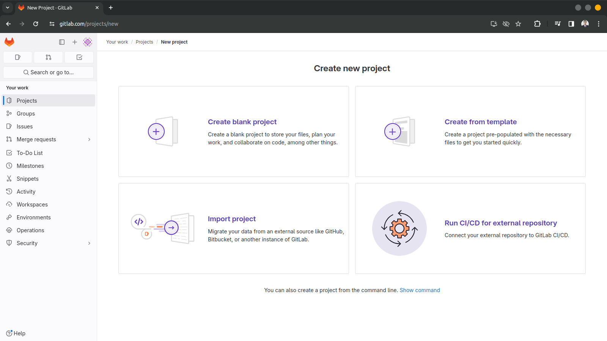
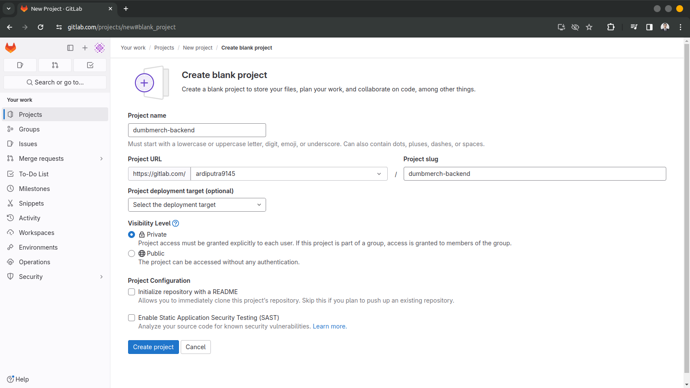
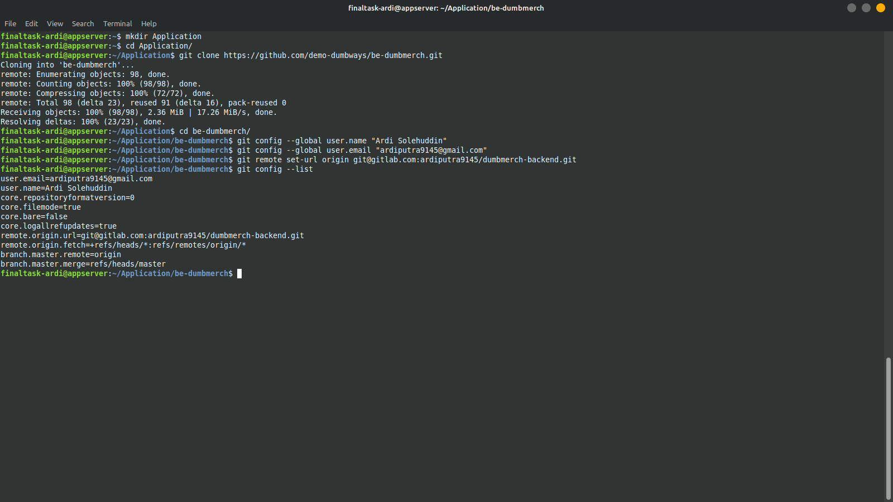
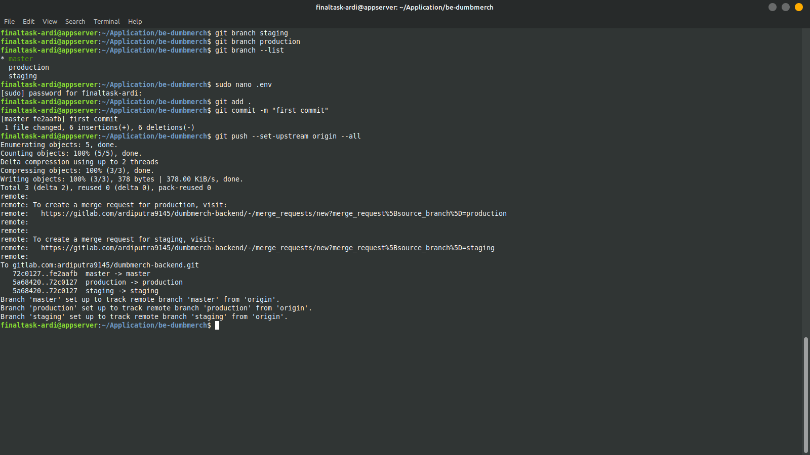
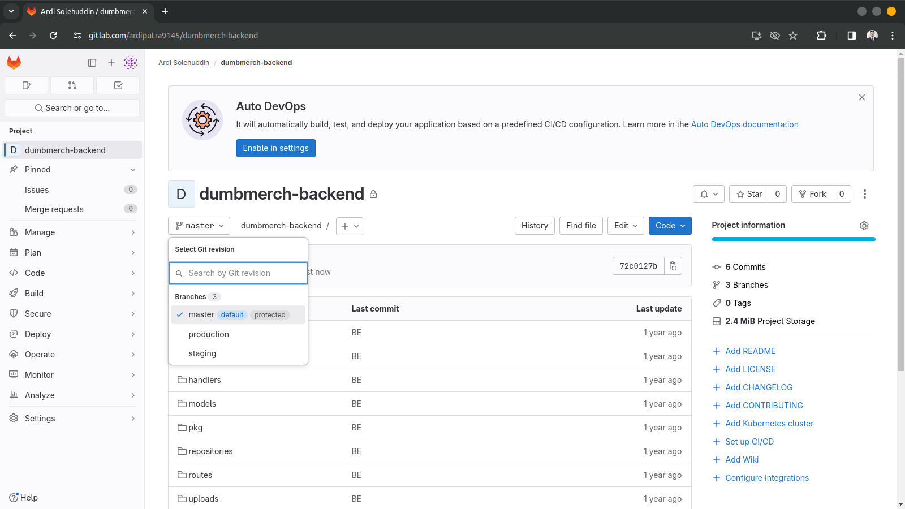
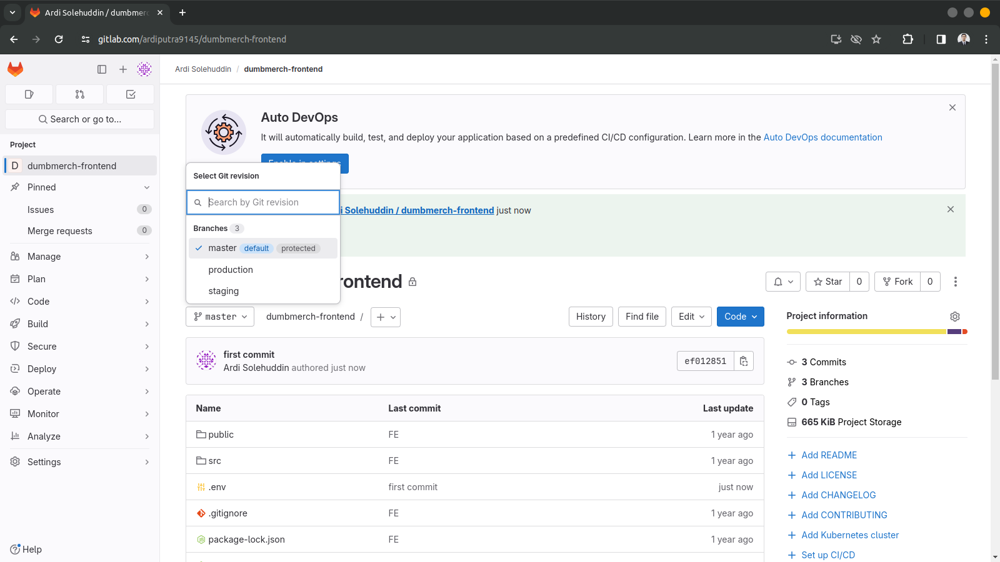

## Repository 
### Membuat Repository Private Untuk Aplikasi

**Requirements**
- Personal Github/GitLab accounts
- Frontend : [fe-dumbmerch](https://github.com/demo-dumbways/fe-dumbmerch)
  - NodeJS v16.x or above
  - Create .env file for FE+BE Integration (REACT_APP_BASEURL)
- Backend : [be-dumbmerch](https://github.com/demo-dumbways/be-dumbmerch)
  - Golang v1.16.x or above
  - Modify .env file for DB Integration

**Instructions**
- Create a repository on Github or Gitlab
- **Private** repository access
- Set up 2 branches
   - Staging
   - Production
- Each Branch have their own CI/CD

#### Langkah Pengerjaan
1. Membuat repository yang akan digunakan saat melakukan push source code aplikasi backend.
    
   

2. Melakukan cloning aplikasi backend yang akan digunakan dan nantinya akan dipush ke gitlab. Sesuaikan git config serta git remote dengan repository yang dibuat pada github atau gitlab
   

3. Melakukan push source code yang sudah dicloning sebelumnya. 
   
   Pada gambar di atas terlebih dahulu membuat dua branch yang akan digunakan yaitu staging sebagai branch testing dan production yang akan digunakan untuk deploy saat aplikasi berhasil dijalankan pada saat staging. Sesuikan juga file .env yang akan digunakan terlebih dahulu yang akan mengarah ke database yang akan digunakan.
   ```
    SECRET_KEY=bolehapaaja
    PATH_FILE=http://localhost:5000/uploads/
    SERVER_KEY=SB-Mid-server-fJAy6udMPnJCIyFguce8Eot3
    CLIENT_KEY=SB-Mid-client-YUogx3u74Gq9MTMS
    EMAIL_SYSTEM=demo.dumbways@gmail.com
    PASSWORD_SYSTEM=rbgmgzzcmrfdtbpu
    DB_HOST=103.127.132.84
    DB_USER=ardi
    DB_PASSWORD=ardi
    DB_NAME=dumbmerch
    DB_PORT=5432 
    PORT=5000
   ```

4. Jika sudah dapat dilihat pada gitlab source code berhasil dipush beserta dengan branch yang sudah dibuat.
   

5. Melakukan hal yang sama pada bagian frontend dengan catatan membuat file .env terlebih dahulu yang akan digunakan agar aplikasi frontend dapat terhubung ke backend.
   ```
   # file script .env 
   REACT_APP_BASEURL=https://api.ardi.studentdumbways.my.id/api/v1
   ```  
   