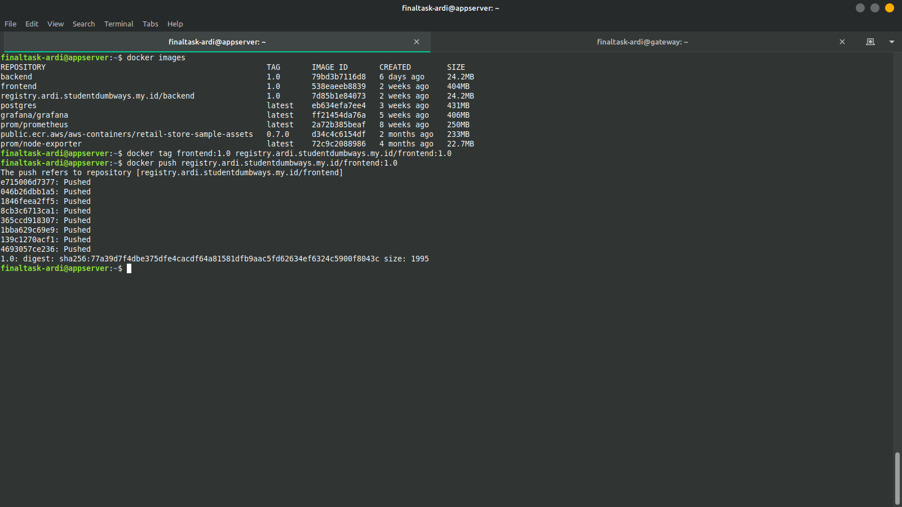

**Requirements**
- Docker Registry Private

**Instructions**

[ *Docker Registry* ]

- Deploy Docker Registry Private on this server
  - IP: 
  - Pass: 

#### Langkah Pengerjaan
1. Membuat script untuk deploy docker registry pada server gateway yang nantinya akan digunakan sebagai server untuk melakukan storing docker image
   ```
    version: '3.8'
    services:

      docker-registry:
        container_name: docker-registry
        image: registry:latest
        ports:
        - "5000:5000"
        restart: always
        environment:
          REGISTRY_AUTH: htpasswd
          REGISTRY_AUTH_HTPASSWD_REALM: Registry Realm
          REGISTRY_AUTH_HTPASSWD_PATH: /auth/.htpasswd
          REGISTRY_STORAGE_FILESYSTEM_ROOTDIRECTORY: /data
        volumes:
          - ./registry-data:/data
          - ./auth:/auth
   ```

3. Menyiapkan htpasswd yang nantinya akan digunakan untuk login ke dalam docker registry
   ```
   ardi:$2y$05$AMzeBlf4Auoak1FgnQcei.d1/eav9zFWzaEUbSXaWvLI.xZOREWxO
   ```

4. Membuat reverse proxy agar docker registry dapat diakses untuk melakukan pull dan push docker image menggunakan domain
   ```
      upstream docker-registry {
      server docker-registry:5000;
    }

    server {
        listen 80;
        server_name registry.ardi.studentdumbways.my.id;
        return 301 https://registry.ardi.studentdumbways.my.id$request_uri;
    }

    server {
        listen 443 ssl http2;
        server_name registry.ardi.studentdumbways.my.id;

        # SSL
        ssl_certificate /etc/letsencrypt/live/ardi.studentdumbways.my.id/fullchain.pem;
        ssl_certificate_key /etc/letsencrypt/live/ardi.studentdumbways.my.id/privkey.pem;

        # Log files for Debug
        error_log /var/log/nginx/error.log;
        access_log  /var/log/nginx/access.log;

        location / {
          # Do not allow connections from docker 1.5 and earlier
          # docker pre-1.6.0 did not properly set the user agent on ping, catch "Go *" user agents
          if ($http_user_agent ~ "^(docker\/1\.(3|4|5(?!\.[0-9]-dev))|Go ).*$" ) {
            return 404;
          }

          proxy_pass                          http://docker-registry;
          proxy_set_header  Host              $http_host;   # required for docker client's sake
          proxy_set_header  X-Real-IP         $remote_addr; # pass on real client's IP
          proxy_set_header  X-Forwarded-For   $proxy_add_x_forwarded_for;
          proxy_set_header  X-Forwarded-Proto $scheme;
          proxy_read_timeout                  900;
        }
    }
   ```

5. Melakukan docker login serta melakukan testing push images ke docker registry private
   
   