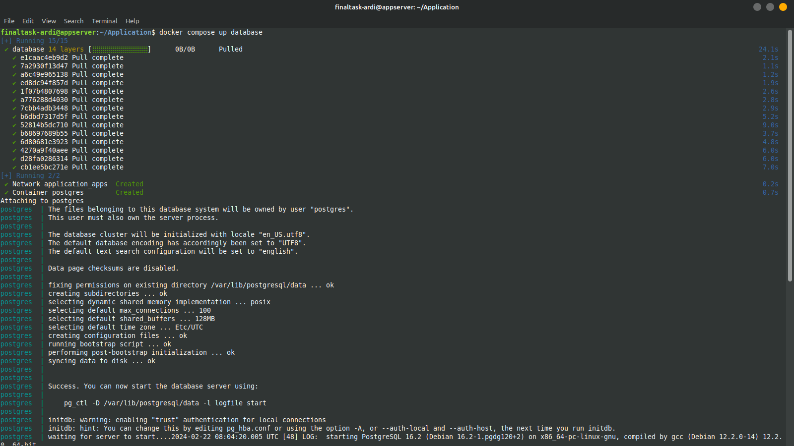
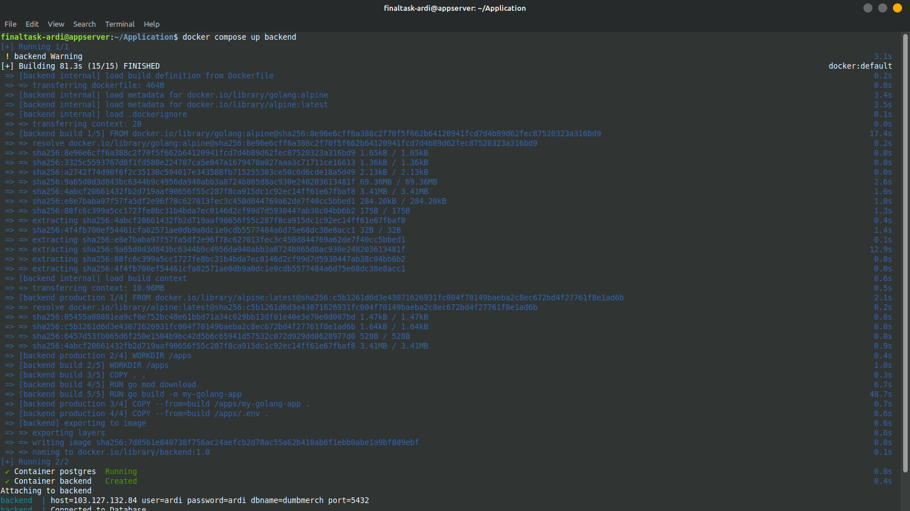
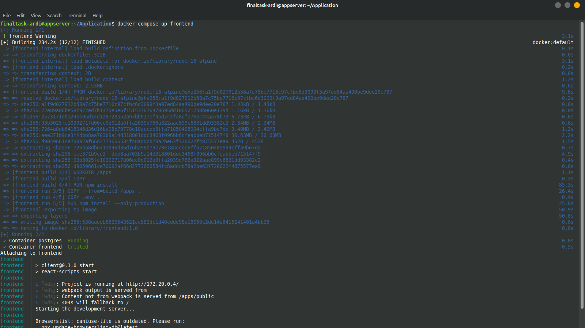
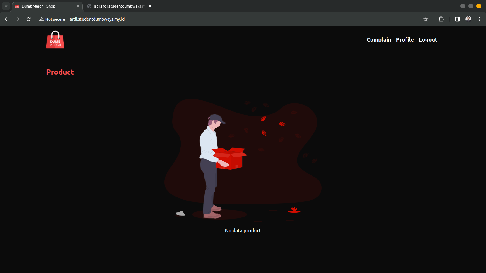

**Requirements**
- Deployments on top Docker
- Frontend : [fe-dumbmerch](https://github.com/demo-dumbways/fe-dumbmerch)
- Backend : [be-dumbmerch](https://github.com/demo-dumbways/be-dumbmerch)

**Instructions**

[ *Database* ]
- App database using *PostgreSQL*
- Deploy postgresql on top docker
- Set the volume location in `/home/$USER/`
- Allow database to remote from another server

[ *Application* ]

- Create a Docker image for frontend & backend
- Staging: A lightweight docker image (as small as possible)
- Production: Deploy a production ready app
- Building Docker image on every environment using docker multistage build
- Create load balancing for frontend and backend


### Langkah Pengerjaan

1. Membuat file docker compose terlebih dahulu untuk melakukan deploy database postgresql agar nantinya backend dapat terhubung dan melakukan migrasi ke database.
   ```
   # Script For Docker Compose 
   
   version: '3.8'
   services:

   database:
      container_name: postgres
      image: postgres:latest
      restart: always
      ports:
         - "5432:5432"
      environment:
         - POSTGRES_PASSWORD=${PASSWORD}
         - POSTGRES_USER=${USERNAME}
         - POSTGRES_DB=${DATABASE}
      volumes:
         - ~/postgres:/var/lib/postgresql
      networks:
         apps:

   networks:
   apps:
      driver: bridge
   ``` 
   Runnning docker compose :
   ```
   docker compose up -d database
   ```
   

2. Membuat Dockerfile multistage pada aplikasi backend sebagai acuan dalam melakukan building image serta nantinya akan dirunning container dengan docker compose. Docker multistage berfungsi agar aplikas yang akan dibuild memiliki ukuran image sekecil mungkin.
   ```
   # Stage 1: Build Stage
   FROM golang:alpine AS build

   WORKDIR /apps

   COPY . .

   RUN go mod download

   # Build the application
   RUN go build -o my-golang-app

   # Stage 2: Production Stage
   FROM alpine:latest AS production

   WORKDIR /apps

   # Copy only the necessary files from the build stage
   COPY --from=build /apps/my-golang-app .
   COPY --from=build /apps/.env .

   EXPOSE 5000

   # Command to run the application
   CMD ["./my-golang-app"]
   ```
   Running Docker Compose:
   ```
   docker compose up -d backend
   ```
   
3. Melakukan hal yang sama yaitu membuat Dockerfile multistage untuk frontend.
   ```
   # Stage 1: Build Stage
   FROM node:16-alpine AS build

   WORKDIR /apps

   COPY . .

   # Install dependencies and build the application
   RUN npm install
   RUN npm run build

   # Stage 2: Production Stage
   FROM node:16-alpine AS production

   WORKDIR /apps

   # Copy only the necessary files from the build stage
   COPY --from=build /apps/build ./
   COPY --from=build /apps/ package*.json ./

   # Install only production dependencies
   RUN npm install --only=production

   EXPOSE 3000

   # Command to run the application
   CMD ["npm", "start"]
      ```
   Running Docker Compose:
   ```
   docker compose up -d frontend
   ```
   

4. Testing berjalannya aplikasi
   