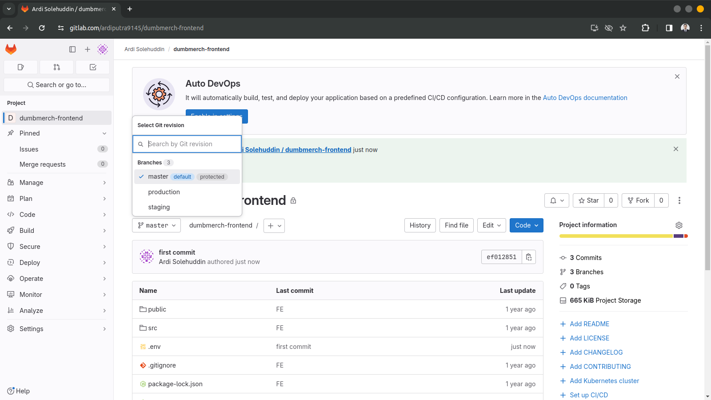
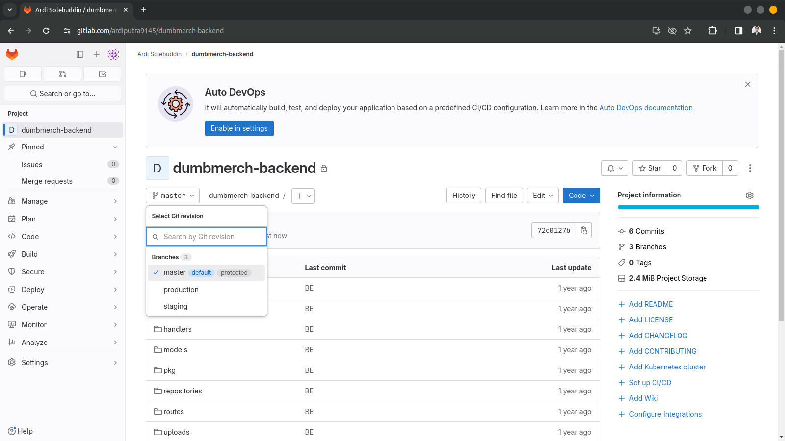
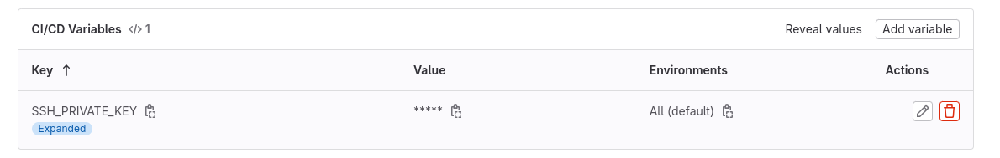
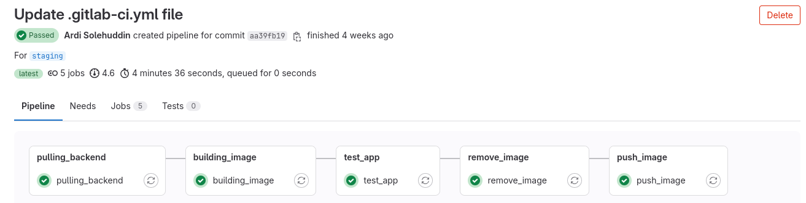
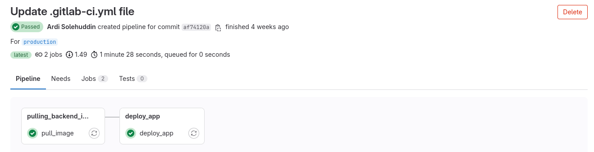

**Requirements**
- CI/CD with GitLab

**Instructions**

[ *CI/CD* ]

- Using GitLab, create a pipeline running:
   - Repository pull
   - Image build
   - Testing
   - Push Image into your own docker registry private
   - SSH into your biznet server
   - Pull image from docker registry private
   - Redeploy your deployment apps

### Langkah Pengerjaan 
1. Siapkan terlebih dahulu repository yang akan digunakan pada Gitlab sesuai dengan langkah yang ada pada [repository](<../2. Repository/repository.md>)
    
  
2. Input terlebih dahulu SSH KEY yang akan digunakan pada gitlab variables beserta variables lainnya agar tidak mudah dibaca oleh orang lain berkaitan dengan keamanan server.
   

### Branch Staging
1. Masuk ke repository pada server serta masuk ke branch staging.
2. Buat file `.gitlab-ci.yml` untuk membuat script testing application</br>
   #### Frontend
   ```
   .job_template_config: &sshconfig
   before_script:
      - "which ssh-agent || ( apt-get install openssh-client )"
      - eval $(ssh-agent -s)
      - echo "$SSH_PRIVATE_KEY" | tr -d '\r' > id_rsa
      - chmod 600 id_rsa
      - ssh-add id_rsa 
      - mkdir -p ~/.ssh
      - chmod 700 ~/.ssh
      - ssh-keyscan -p 1234 103.127.132.84 >> ~/.ssh/known_hosts
      - chmod 644 ~/.ssh/known_hosts
      - '[[ -f /.dockerenv ]] && echo -e "Host *\n\tStrictHostKeyChecking no\n\n" > ~/.ssh/config'
   
   stages:
   - pulling_frontend
   - building_image
   - test_app
   - remove_image
   - push_image

   variables:
   SERVER: 'ardi@103.127.132.84'
   DIR_BE: '/home/ardi/Application/frontend-dumbmerch'
   BRANCH: 'staging'
   IMAGES_BE: 'ardi2105/frontend:test'
   DOMAIN_BE: 'https://ardi.studentdumbways.my.id'
   
   pulling_frontend:
   stage: pulling_frontend
   image: docker
   services:
      - docker:dind
   <<: *sshconfig
   script:
      - ssh -p 1234 $SERVER
         "cd $DIR_BE;
         git checkout $BRANCH;
         git pull origin $BRANCH;
         exit"

   building_image:
   stage: building_image
   image: docker
   services:
      - docker:dind
   <<: *sshconfig
   script:
      - ssh -p 1234 $SERVER
      "cd $DIR_BE;
      docker compose up -d backend;
      docker build -t $IMAGES_BE .;
      docker images;
      docker stop frontendtest;
      docker rm frontendtest;
      docker run -d --name frontendtest -p 6000:3000 $IMAGES_BE;
      exit"
         
   test_app:
   stage: test_app
   image: docker
   services:
      - docker:dind
   <<: *sshconfig
   script:
      - ssh -p 1234 $SERVER
      "docker ps -a;
      wget --spider localhost:6000;
      docker ps -a;
      exit"
         
   remove_image:
   stage: remove_image
   image: docker
   services:
      - docker:dind
   <<: *sshconfig 

   script:
      - ssh -p 1234 $SERVER 
      "docker stop frontendtest;
      docker rm frontendtest;
      docker rmi $IMAGES_BE;
      exit"

   push_image:
   stage: push_image
   image: docker
   services:
      - docker:dind
   <<: *sshconfig
   script:
      - ssh -p 1234 $SERVER
      "cd $DIR_BE;
      docker build -t ardi2105/frontend:v1 .;
      docker push ardi2105/frontend:v1;
      exit"

   ```
   ### Backend
   ```
   .job_template_config: &sshconfig
   before_script:
      - "which ssh-agent || ( apt-get install openssh-client )"
      - eval $(ssh-agent -s)
      - echo "$SSH_PRIVATE_KEY" | tr -d '\r' > id_rsa
      - chmod 600 id_rsa
      - ssh-add id_rsa 
      - mkdir -p ~/.ssh
      - chmod 700 ~/.ssh
      - ssh-keyscan -p 1234 103.127.132.84 >> ~/.ssh/known_hosts
      - chmod 644 ~/.ssh/known_hosts
      - '[[ -f /.dockerenv ]] && echo -e "Host *\n\tStrictHostKeyChecking no\n\n" > ~/.ssh/config'
   
   stages:
   - pulling_backend
   - building_image
   - test_app
   - remove_image
   - push_image

   variables:
   SERVER: 'ardi@103.127.132.84'
   DIR_BE: '/home/ardi/Application/backend-dumbmerch'
   BRANCH: 'staging'
   IMAGES_BE: 'ardi2105/backend:test'
   DOMAIN_BE: 'https://api.ardi.studentdumbways.my.id'
   
   pulling_backend:
   stage: pulling_backend
   image: docker
   services:
      - docker:dind
   <<: *sshconfig
   script:
      - ssh -p 1234 $SERVER
         "cd $DIR_BE;
         git checkout $BRANCH;
         git pull origin $BRANCH;
         exit"

   building_image:
   stage: building_image
   image: docker
   services:
      - docker:dind
   <<: *sshconfig
   script:
      - ssh -p 1234 $SERVER
      "cd $DIR_BE;
      docker compose up -d database;
      docker build -t $IMAGES_BE .;
      docker images;
      docker stop backendtest;
      docker rm backendtest;
      docker run -d --name backendtest -p 7000:5000 $IMAGES_BE;
      exit"
         
   test_app:
   stage: test_app
   image: docker
   services:
      - docker:dind
   <<: *sshconfig
   script:
      - ssh -p 1234 $SERVER
      "docker ps -a;
      wget --spider localhost:7000;
      docker ps -a;
      exit"
         
   remove_image:
   stage: remove_image
   image: docker
   services:
      - docker:dind
   <<: *sshconfig 

   script:
      - ssh -p 1234 $SERVER 
      "docker stop backendtest;
      docker rm backendtest;
      docker rmi $IMAGES_BE;
      exit"

   push_image:
   stage: push_image
   image: docker
   services:
      - docker:dind
   <<: *sshconfig
   script:
      - ssh -p 1234 $SERVER
      "cd $DIR_BE;
      docker build -t ardi2105/backend:v1 .;
      docker push ardi2105/backend:v1;
      exit"
   ```
3. Pada bagian testing akan terdiri dari beberapa tahap dalam melakukan testing aplikasi sampai berhasil untuk nantinya dilanjutkan ke branch production or release.
   

### Branch Production
1. Masuk ke repository pada server serta masuk ke branch production.
2. Buat file `.gitlab-ci.yml` untuk membuat script deploy application
   ### Frontend
   ```
   .job_template_config: &sshconfig
   before_script:
      - "which ssh-agent || ( apt-get install openssh-client )"
      - eval $(ssh-agent -s)
      - echo "$SSH_PRIVATE_KEY" | tr -d '\r' > id_rsa
      - chmod 600 id_rsa
      - ssh-add id_rsa 
      - mkdir -p ~/.ssh
      - chmod 700 ~/.ssh
      - ssh-keyscan -p 1234 103.127.132.84 >> ~/.ssh/known_hosts
      - chmod 644 ~/.ssh/known_hosts
      - '[[ -f /.dockerenv ]] && echo -e "Host *\n\tStrictHostKeyChecking no\n\n" > ~/.ssh/config'
   

   stages:
   - pulling_frontend_image
   - deploy_app

   variables:
   SERVER: 'ardi@103.127.132.84'
   DIR_BE: '/home/ardi/Application'
   IMAGES_BE: 'ardi2105/frontend:v1'
   
   pull_image:
   stage: pulling_frontend_image
   image: docker
   services:
      - docker:dind
   <<: *sshconfig
   script:
      - ssh -p 1234 $SERVER
      "cd $DIR_BE;
      docker pull ardi2105/frontend:v1;
      exit"

   deploy_app:
   stage: deploy_app
   image: docker
   services:
      - docker:dind
   <<: *sshconfig
   script:
      - ssh -p 1234 $SERVER
         "cd /home/ardi/Application;
         docker compose down frontend;
         docker compose up -d frontend;
         exit"
   ```
   ### Backend
   ```
   .job_template_config: &sshconfig
   before_script:
      - "which ssh-agent || ( apt-get install openssh-client )"
      - eval $(ssh-agent -s)
      - echo "$SSH_PRIVATE_KEY" | tr -d '\r' > id_rsa
      - chmod 600 id_rsa
      - ssh-add id_rsa 
      - mkdir -p ~/.ssh
      - chmod 700 ~/.ssh
      - ssh-keyscan -p 1234 103.127.132.84 >> ~/.ssh/known_hosts
      - chmod 644 ~/.ssh/known_hosts
      - '[[ -f /.dockerenv ]] && echo -e "Host *\n\tStrictHostKeyChecking no\n\n" > ~/.ssh/config'
   

   stages:
   - pulling_backend_image
   - deploy_app

   variables:
   SERVER: 'ardi@103.127.132.84'
   DIR_BE: '/home/ardi/Application'
   IMAGES_BE: 'ardi2105/backend:v1'
   
   pull_image:
   stage: pulling_backend_image
   image: docker
   services:
      - docker:dind
   <<: *sshconfig
   script:
      - ssh -p 1234 $SERVER
      "cd $DIR_BE;
      docker pull ardi2105/backend:v1;
      exit"

   deploy_app:
   stage: deploy_app
   image: docker
   services:
      - docker:dind
   <<: *sshconfig
   script:
      - ssh -p 1234 $SERVER
         "cd /home/ardi/Application;
         docker compose down backend;
         docker compose up -d backend;
         exit"
   ```
3. Pada bagian production hanya terdapat dua tahapan yaitu pulling serta deploy aplikasi yang sudah aman serta sudah ditesting oleh quality analist.
   