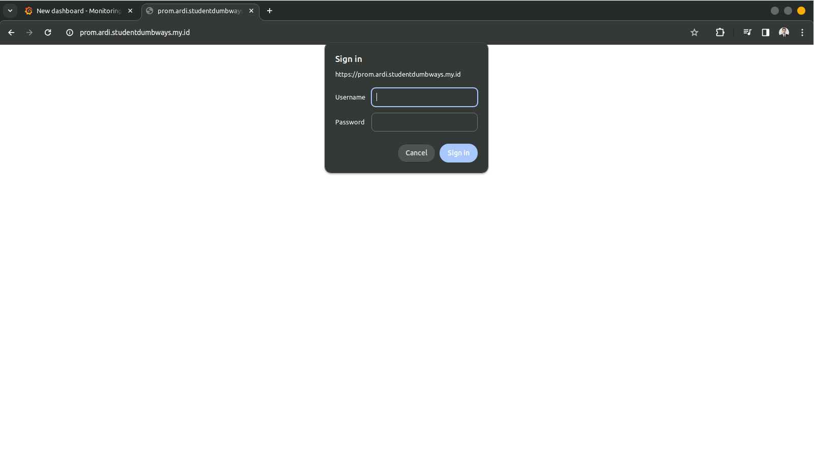
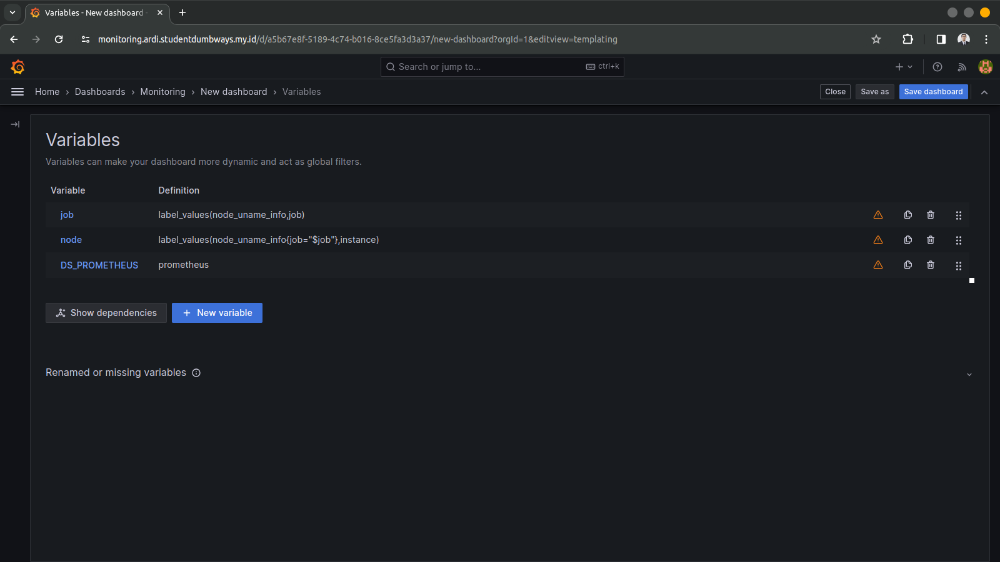
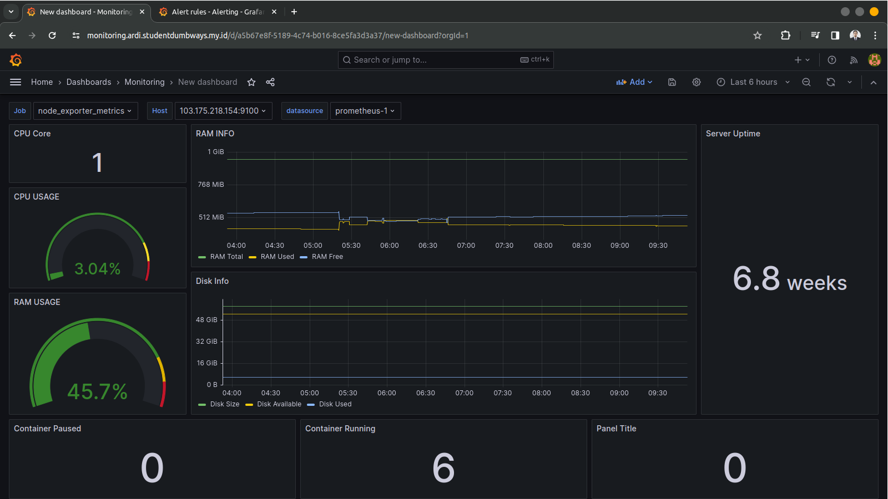
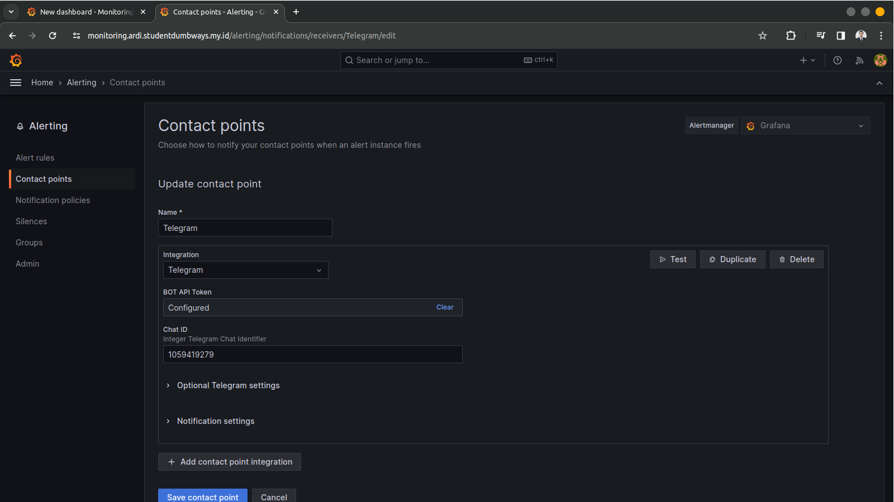
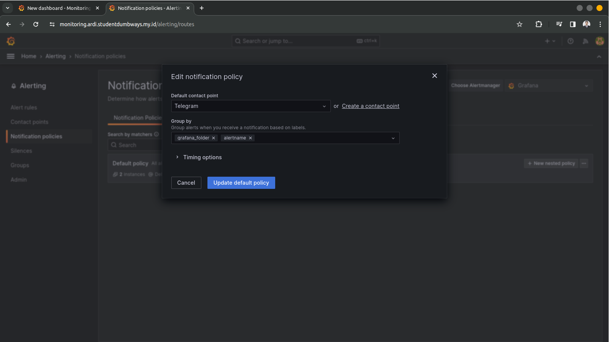
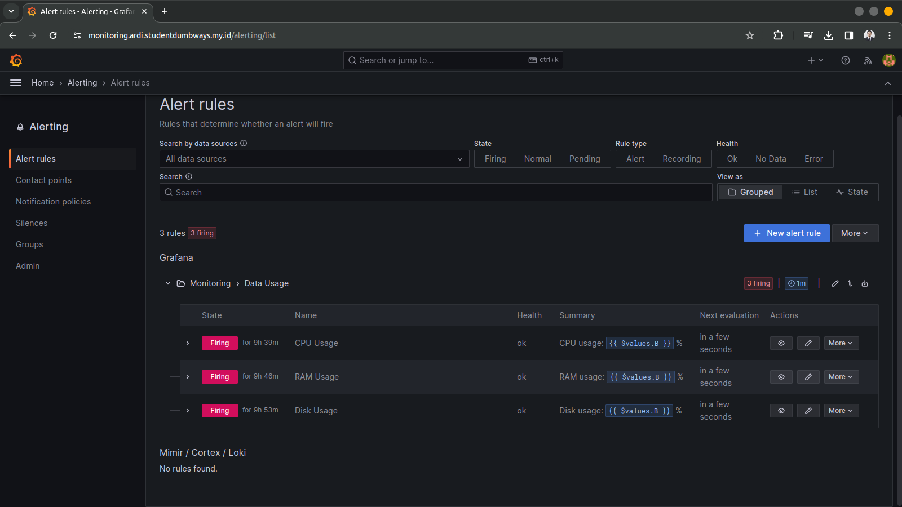
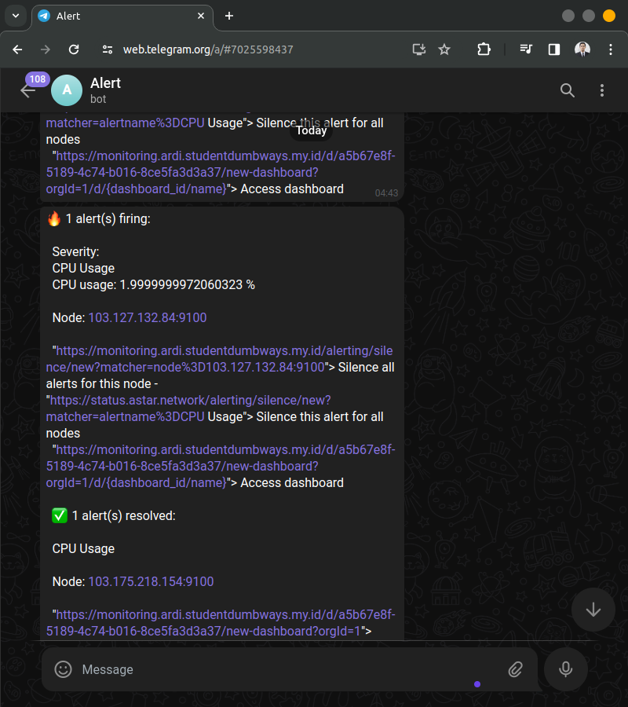

**Requirements**
- Deployments on top Docker

**Instructions**
- Create Basic Auth into your Prometheus
- Monitor resources for *Appserver & Gateway & Registry server*
- Create a fully working dashboard in Grafana
  - Disk
  - Memory Usage
  - CPU Usage
  - VM Network
  - Monitoring all of container resources on VM
- Grafana Alert/Prometheus Alertmanager for:
  - Send Notification to Telegram
  - CPU Usage
  - RAM Usage
  - Free Storage
  - Network I/O (NGINX Monitoring)

#### Langkah Pengerjaan
1. Menyiapkan script docker compose untuk melakukan instalasi Grafana, Promethes serta Node Exporter pada server.
   #### Server Appserver
   ```
    version: '3.8'

    networks:
      monitoring:
        driver: bridge

    volumes:
      prometheus_data: {}

    services:
      node-exporter:
        image: prom/node-exporter:latest
        container_name: node-exporter
        restart: unless-stopped
        volumes:
          - /proc:/host/proc:ro
          - /sys:/host/sys:ro
          - /:/rootfs:ro
        command:
          - '--path.procfs=/host/proc'
          - '--path.rootfs=/rootfs'
          - '--path.sysfs=/host/sys'
          - '--collector.filesystem.mount-points-exclude=^/(sys|proc|dev|host|etc)($$|/)'
        ports:
          - 9100:9100
        networks:
          - monitoring

      prometheus:
        image: prom/prometheus:latest
        container_name: prometheus
        restart: unless-stopped
        volumes:
          - ~/Monitoring/prometheus.yaml:/etc/prometheus/prometheus.yml
          - prometheus_data:/prometheus
        command:
          - '--config.file=/etc/prometheus/prometheus.yml'
          - '--storage.tsdb.path=/prometheus'
          - '--web.console.libraries=/etc/prometheus/console_libraries'
          - '--web.console.templates=/etc/prometheus/consoles'
          - '--web.enable-lifecycle'
        ports:
          - 9200:9090
        networks:
          - monitoring

      grafana:
        image: grafana/grafana:latest
        container_name: grafana
        restart: unless-stopped
        user: root
        ports:
          - 9300:3000
        volumes:
          - ./grafana/data:/var/lib/grafana
          - ./grafana/provisioning/datasources:/etc/grafana/provisioning/datasources
        networks:
          - monitoring
   ```
   #### Server Gateway
   ```
    version: '3.8'

    networks:
      monitoring:
        driver: bridge

    volumes:
      prometheus_data: {}

    services:
      node-exporter:
        image: prom/node-exporter:latest
        container_name: node-exporter
        restart: unless-stopped
        volumes:
          - /proc:/host/proc:ro
          - /sys:/host/sys:ro
          - /:/rootfs:ro
        command:
          - '--path.procfs=/host/proc'
          - '--path.rootfs=/rootfs'
          - '--path.sysfs=/host/sys'
          - '--collector.filesystem.mount-points-exclude=^/(sys|proc|dev|host|etc)($$|/)'
        ports:
          - 9100:9100
        networks:
          - monitoring
   ```

2. Membuat basic auth pada web server
   ```
    server {
            listen 80;
            listen 443 ssl;
            server_name prom.ardi.studentdumbways.my.id;

            ssl_certificate /etc/letsencrypt/live/ardi.studentdumbways.my.id/fullchain.pem;
            ssl_certificate_key /etc/letsencrypt/live/ardi.studentdumbways.my.id/privkey.pem;

            auth_basic "Administrator Login";
            auth_basic_user_file /etc/nginx/conf.d/.htpasswd;

            location / {
                    proxy_pass http://103.127.132.84:9200;
                    proxy_set_header Host $host;
                    proxy_set_header X-Real-IP $remote_addr;
            }
    }
   ```
   
   Karena terdapat basic auth untuk pengamanan, saat mengakses `prom.ardi.studentdumbways.my.id` akan diminta untuk login terlebih dahulu.

3. Membuat variables serta dashboard grafana untuk melakukan monitoring penggunaan RAM, CPU, Penyimpanan serta resource lainnya pada masing masing server.
   
   

4. Menyiapkan bot telegram untuk alerting ketika terdapat resource melebihi batas aman penggunaan.
  

5. Membuat notification policies agar alerting grafana dapat mengirimkan notifikasi ke telegram
   
   

6. Membuat alert rules di mana berisi script ketika terdapat resource yang berlebih akan mengirimkan notifikasi ke telegram
    
    