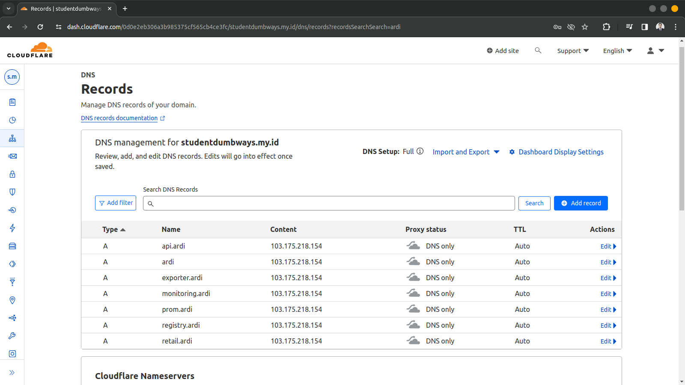

**Requirements**
- NGINX/Apache2/Lightspeed on Gateway
- SSL Certbot using Wildcard
- Automatic SSL (Ansible/Cronjob/Script etc.)

**Instructions**
- Create domains:
  - <name>.studentdumbways.my.id - App
  - api.<name>.studentdumbways.my.id - Backend API
  - exporter.<name>.studentdumbways.my.id - Node Exporter
  - prom.<name>.studentdumbways.my.id - Prometheus
  - monitoring.<name>.studentumbways.my.id - Grafana
  - registry.<name>.studentdumbways.my.id - Docker Registry
- All domains are HTTPS
- Create Bash Script for Automatic renewal for Certificates

#### Langkah Pengerjaan
1. Membuat script docker-compose untuk instalasi nginx serta certbot untuk generate SSL Certificate pada docker 
   ```
    version: '3.8'
    services:

      certbot:
        container_name: certbot
        image: certbot/dns-cloudflare
        volumes:
          - ~/certbot:/etc/letsencrypt
          - ~/.secrets/cloudflare.ini:/etc/letsencrypt/cloudflare.ini
        environment:
          - CERTBOT_DOMAIN=*.ardi.studentdumbways.my.id
          - CERTBOT_EMAIL=ardiputra9145@gmail.com
        command: certonly --dns-cloudflare --dns-cloudflare-credentials /etc/letsencrypt/cloudflare.ini --agree-tos --email ardiputra9145@gmail.com -d ardi.studentdumbways.my.id,*.ardi.studentdumbways.my.id --force-renewal

      nginx:
        container_name: nginx
        image: nginx:alpine
        ports:
          - "80:80"
          - "443:443"
        volumes:
          - ./nginx:/etc/nginx/conf.d
          - ./certbot:/etc/letsencrypt
          - ./scripts:/scripts
        depends_on:
          - certbot
        command: ["/bin/sh", "/scripts/startup.sh"]

      docker-registry:
        container_name: docker-registry
        image: registry:latest
        ports:
        - "5000:5000"
        restart: always
        environment:
          REGISTRY_AUTH: htpasswd
          REGISTRY_AUTH_HTPASSWD_REALM: Registry Realm
          REGISTRY_AUTH_HTPASSWD_PATH: ./auth
          REGISTRY_STORAGE_FILESYSTEM_ROOTDIRECTORY: /data
        volumes:
          - ./Registry/registry-data:/data
          - ./auth:/auth
   ```

2. Menyiapkan script untuk reverse proxy yang akan digunakan aplikasi</br>
   *Reverse Proxy Application*
   ```
    server {
          listen 80;
          listen 443 ssl;
          server_name ardi.studentdumbways.my.id;

          ssl_certificate /etc/letsencrypt/live/ardi.studentdumbways.my.id/fullchain.pem;
          ssl_certificate_key /etc/letsencrypt/live/ardi.studentdumbways.my.id/privkey.pem;

          location / {
                  proxy_pass http://103.127.132.84:4000;
      proxy_set_header Host $host;
                  proxy_set_header X-Real-IP $remote_addr;
          }
    }

    server {
            listen 80;
            listen 443 ssl;
            server_name api.ardi.studentdumbways.my.id;

            ssl_certificate /etc/letsencrypt/live/ardi.studentdumbways.my.id/fullchain.pem;
            ssl_certificate_key /etc/letsencrypt/live/ardi.studentdumbways.my.id/privkey.pem;

            location / {
                    proxy_pass http://103.127.132.84:5000;
        proxy_set_header Host $host;
                    proxy_set_header X-Real-IP $remote_addr;
            }
    }

   ```
   *Reverse Proxy For Monitoring*
   ```
    server {
          listen 80;
          listen 443 ssl;
          server_name exporter.ardi.studentdumbways.my.id;

          ssl_certificate /etc/letsencrypt/live/ardi.studentdumbways.my.id/fullchain.pem;
          ssl_certificate_key /etc/letsencrypt/live/ardi.studentdumbways.my.id/privkey.pem;

          location / {
                  proxy_pass http://103.127.132.84:9100;
      proxy_set_header Host $host;
                  proxy_set_header X-Real-IP $remote_addr;
          }
    }

    server {
            listen 80;
            listen 443 ssl;
            server_name prom.ardi.studentdumbways.my.id;

            ssl_certificate /etc/letsencrypt/live/ardi.studentdumbways.my.id/fullchain.pem;
            ssl_certificate_key /etc/letsencrypt/live/ardi.studentdumbways.my.id/privkey.pem;

      auth_basic "Administrator Login";
      auth_basic_user_file /etc/nginx/conf.d/.htpasswd;

            location / {
                    proxy_pass http://103.127.132.84:9200;
        proxy_set_header Host $host;
                    proxy_set_header X-Real-IP $remote_addr;
            }
    }

    server {
            listen 80;
            listen 443 ssl;
            server_name monitoring.ardi.studentdumbways.my.id;

            ssl_certificate /etc/letsencrypt/live/ardi.studentdumbways.my.id/fullchain.pem;
            ssl_certificate_key /etc/letsencrypt/live/ardi.studentdumbways.my.id/privkey.pem;

            location / {
                    proxy_pass http://103.127.132.84:9300;
        proxy_set_header Host $host;
                    proxy_set_header X-Real-IP $remote_addr;
            }
    }

   ```
   *Reverse Proxy For Docker Registry Private*
   ```
    upstream docker-registry {
      server docker-registry:5000;
    }

    server {
        listen 80;
        server_name registry.ardi.studentdumbways.my.id;
        return 301 https://registry.ardi.studentdumbways.my.id$request_uri;
    }

    server {
        listen 443 ssl http2;
        server_name registry.ardi.studentdumbways.my.id;

        # SSL
        ssl_certificate /etc/letsencrypt/live/ardi.studentdumbways.my.id/fullchain.pem;
        ssl_certificate_key /etc/letsencrypt/live/ardi.studentdumbways.my.id/privkey.pem;

        # Log files for Debug
        error_log /var/log/nginx/error.log;
        access_log  /var/log/nginx/access.log;

        location / {
          # Do not allow connections from docker 1.5 and earlier
          # docker pre-1.6.0 did not properly set the user agent on ping, catch "Go *" user agents
          if ($http_user_agent ~ "^(docker\/1\.(3|4|5(?!\.[0-9]-dev))|Go ).*$" ) {
            return 404;
          }

          proxy_pass                          http://docker-registry;
          proxy_set_header  Host              $http_host;   # required for docker client's sake
          proxy_set_header  X-Real-IP         $remote_addr; # pass on real client's IP
          proxy_set_header  X-Forwarded-For   $proxy_add_x_forwarded_for;
          proxy_set_header  X-Forwarded-Proto $scheme;
          proxy_read_timeout                  900;
        }
    }
   ```

3. Menyiapkan DNS yang akan digunakan menggunakan cloudflare mengarah ke IP server yang akan digunakan sebagai web server
   

4. Membuat script untuk auto renewal SSL Certificate pada certbot
   ```
    #!/bin/sh

    # Start Nginx
    nginx -g "daemon off;" &

    # Schedule Certbot renewal
    while :; do
      certbot renew
      sleep 12h
    done
   ```

5. Website dapat diakses menggunakan domain serta sudah diamankan menggunakan HTTPS dengan SSL Certificate menggunakan certbot dan letsencrypt
   